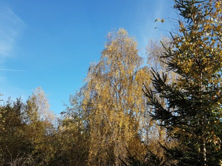

Idag går solen upp 07:39 och ned 17:50. Månen går upp 06:47 och ned 18:12 Månen är belyst 1 %. Dagens längd är 10 timmar och 11 minuter.

 Regn 8,1 C  Vindby 1,6 m/s SW  Luftfuktighet 98 %  hPa 1013  Regn 1,3 mm Kl.01:25

 Molnigt 7 C  Vindby 1,2 m/s W  Luftfuktighet 97 %  hPa 1013  Regn 1,8 mm Kl.06:50

 Växlande molnighet 14,3 C  Vindby 3,8 m/s NW  Luftfuktighet 69 %  hPa 1014  Regn 2,3 mm Kl.14:15

 Mest molnigt 7,7 C  Vindby 2,6 m/s SE  Luftfuktighet 88 %  hPa 1014 Kl.20:05

 

Högst och lägst uppmätta temperatur igår (inofficiellt privat mätare): Max 16,1 C , Min 9,1 C Högst uppmätta vind 2 m/s. Högst uppmätta vindby 4,8  m/s.

Högst och lägst uppmätta temperatur igår (officiellt enligt [YR.NO](http://www.vackertvader.se/v%C3%A4derstation/karlshamn?utm_source=email&utm_medium=email&utm_campaign=asarum)) Max 14,5 C, Min 9,6 C Högst uppmätta vind 2,1 m/s. Högst uppmätta vindby 6,7 m/s

 

 Blå himmel, sol och vackra höstfärger.

Spara

Spara

Spara

Spara

Spara
