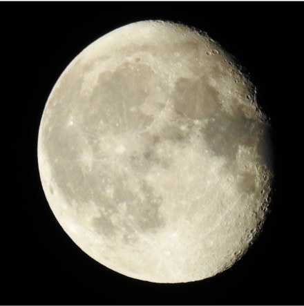
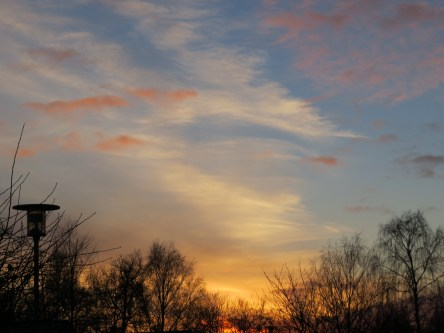

Idag går solen upp 08:09 och ned 15:29. Månen går upp 15:24 och ned 05:48 Månen är belyst 96 %. Dagens längd är 7 timmar och 20 minuter.

 En del moln - 3,8 C  Vindstilla  Luftfuktighet 89 %  hPa 1014 Kl.02:30

 Klart - 7,2 C  Vindby 0,3 m/s NE  Luftfuktighet 90 %  hPa 1016 Kl.07:00

 Växlande molnighet 3,3 C  Vindby 1,8 m/s SE  Luftfuktighet 76 %  hPa 1016 Kl.14:20

 Molnigt 1,3 C  Vindby 2,2 m/s E  Luftfuktighet 85 %  hPa 1015 Kl.19:50

 

 Kallt och ruggigt men äntligen lördag!

 

Högst och lägst uppmätta temperatur igår (inofficiellt privat mätare): Max 4,1 C , Min – 4,8 C Högst uppmätta vind 2,4 m/s. Högst uppmätta vindby 4,8 m/s.

Högst och lägst uppmätta temperatur igår (officiellt enligt [YR.NO](http://www.vackertvader.se/v%C3%A4derstation/karlshamn?utm_source=email&utm_medium=email&utm_campaign=asarum)) Max 2,9 C, Min – 1,2 C Högst uppmätta vind 3,6 m/s. Högst uppmätta vindby 8,3 m/s

 

 Från snart fullmåne till solnedgång idag.
