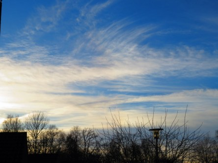

Idag går solen upp 08:31 och ned 15:25. Månen går upp 10:21 och ned 18:43 Månen är belyst 7 %. Dagens längd är 6 timmar och 54 minuter.

 Molnigt 5,9 C  Vindby 1,4 m/s NW  Luftfuktighet 98 %  hPa 1018 Kl.02:10

 Växlande molnighet 4,1 C  Vindby 1,6 m/s E  Luftfuktighet 99 %  hPa 1017 Kl.06:50

 Växlande molnighet 6,1 C  Vindby 2 m/s NW  Luftfuktighet 80 %  hPa 1018 Kl.13:30

Mest molnigt 3,8 C  Vindby 1,6 m/s SE  Luftfuktighet 92 %  hPa 1017 Kl.20:00

 

 Idag är det vintersolstånd och årets längsta natt. Men dagen bjöd på sol och härligt väder tills solen bestämde sig för att krypa ner under molntäcket igen. Jag antar att hon är väldigt trött just nu, precis som så många andra under denna mörka tid på året.

 

Högst och lägst uppmätta temperatur igår (inofficiellt privat mätare): Max 5,6 C , Min - 1,5 C Högst uppmätta vind 2 m/s. Högst uppmätta vindby 2,7 m/s.

Högst och lägst uppmätta temperatur igår (officiellt enligt [YR.NO](http://www.vackertvader.se/v%C3%A4derstation/karlshamn?utm_source=email&utm_medium=email&utm_campaign=asarum)) Max 4,9 C, Min - 1,6 C Högst uppmätta vind 1,7 m/s. Högst uppmätta vindby 4,5 m/s

 

 En härlig dag med uppfriskande blå himmel och sol.
