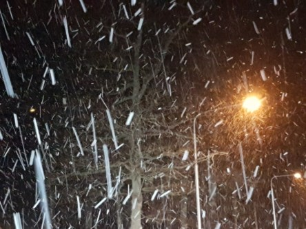

Idag går solen upp 07:51 och ned 15:41. Månen går upp 11:02 och ned 18:54 Månen är belyst 11 %. Dagens längd är 7 timmar och 50 minuter.

 Mest molnigt - 2,3 C  Vindby 2,2 m/s WNW  Luftfuktighet 96 %  hPa 1004 Kl.02:20

 Snö som övergått i regn 1,7 C  Vindby 8,5 m/s SE  Luftfuktighet 99 %  hPa 1001  Regn 3,2 mm Kl.07:00

 Regn 7 C  Vindby 2,7 m/s SSW  Luftfuktighet 99 %  hPa 998  Regn 14,5 mm Kl.13:30

 Molnigt 8,7 C  Vindby 4,6 m/s NE  Luftfuktighet 99 %  hPa 997  Regn 16,7 mm Kl.19:50

 

Högst och lägst uppmätta temperatur igår (inofficiellt privat mätare): Max 2,4 C , Min – 5,1 C Högst uppmätta vind 1 m/s. Högst uppmätta vindby 2,4 m/s.

Högst och lägst uppmätta temperatur igår (officiellt enligt [YR.NO](http://www.vackertvader.se/v%C3%A4derstation/karlshamn?utm_source=email&utm_medium=email&utm_campaign=asarum)) Max - 1,6 C, Min – 4,9 C Högst uppmätta vind 2,2 m/s. Högst uppmätta vindby 4,4 m/s

 

 Det blev en kort men intensiv vinter inatt.
