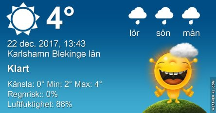
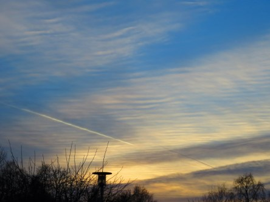

Idag går solen upp 08:31 och ned 15:26. Månen går upp 10:51 och ned 19:48 Månen är belyst 12 %. Dagens längd är 6 timmar och 53 minuter

 Växlande molnighet 1,6 C  Vindby 0,7 m/s W  Luftfuktighet 92 %  hPa 1017 Kl.02:35

 Växlande molnighet 1,4 C  Vindby 1 m/s S  Luftfuktighet 93 %  hPa 1017 Kl.06:55

 Molnigt 5,3 C   Vindby 0,6 m/s SW  Luftfuktighet 80 %  hPa 1018 Kl.13:30

 Växlande molnighet 1,7 C  Vindby 1,6 m/s SE  Luftfuktighet 97 %  hPa 1019 Kl.19:50

 

 Nu blir det lite varmare ett tag.

 

Högst och lägst uppmätta temperatur igår (inofficiellt privat mätare): Max 7,6 C , Min 2,1 C Högst uppmätta vind 2,4 m/s. Högst uppmätta vindby 4,1 m/s.

Högst och lägst uppmätta temperatur igår (officiellt enligt [YR.NO](http://www.vackertvader.se/v%C3%A4derstation/karlshamn?utm_source=email&utm_medium=email&utm_campaign=asarum)) Max 5,8 C, Min 2,9 C Högst uppmätta vind 3,7 m/s. Högst uppmätta vindby 10,2 m/s

 

 Väldigt speciella moln ikväll. Jag är inte helt säker men tror att detta är valkmoln eller stratocumulus som är det korrekta namnet på dessa moln.
