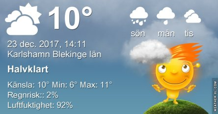
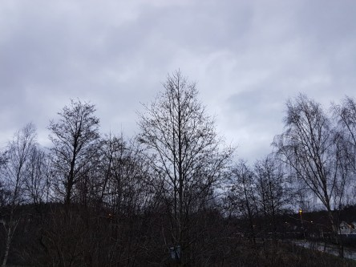

Idag går solen upp 08:32 och ned 15:26. Månen går upp 11:16 och ned 20:56 Månen är belyst 19 %. Dagens längd är 6 timmar och 54 minuter

 Regn 4 C  Vindby 2 m/s E   Luftfuktighet 97 %  hPa 1013  Regn 1 mm Kl.02:35

 Molnigt 7,6 C  Vindby 5 m/s E  Luftfuktighet 93 %  hPa 1006  Regn 1,5 mm Kl.07:25

 Blåsigt 10,7 C  Vindby 9,5 m/s N  Luftfuktighet 88 %  hPa 1000 Kl.14:35

 Molnigt och blåsigt 10,9 C  Vindby 6 m/s SSE  Luftfuktighet 76 %  hPa 997 Kl.20:30

 

 Idag är det väldigt blåsigt och grått.

Högst och lägst uppmätta temperatur igår (inofficiellt privat mätare): Max 8,4 C , Min 0,4 C Högst uppmätta vind 2,4 m/s. Högst uppmätta vindby 3,4 m/s.

Högst och lägst uppmätta temperatur igår (officiellt enligt [YR.NO](http://www.vackertvader.se/v%C3%A4derstation/karlshamn?utm_source=email&utm_medium=email&utm_campaign=asarum)) Max 4,6 C, Min 1,5 C Högst uppmätta vind 3,2 m/s. Högst uppmätta vindby 7,9 m/s

 

 Mörkt, grått och varmt idag.
