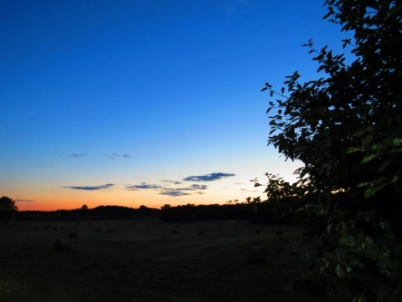

Idag går solen upp 05:45 och ned 20:19. Månen går upp 07:40 och ned 21:06 Månen är belyst 2 %. Dagens längd är 14 timmar och 34 minuter.

 Klart 7,5 C  Vindstilla  Luftfuktighet 97 %  hPa 1013 Kl.02:10

 Växlande molnighet 10,3 C  Vindby 1,4 m/s SE  Luftfuktighet 98 %  hPa 1013 Kl.07:15

 Halvklart 25,3 C  Vindby 2,8 m/s SE  Luftfuktighet 26 %  hPa 1012 Kl.14:50

 Halvklart 14,6 C  Vindby 0,3 m/s NW   Luftfuktighet 72 %  hPa 1012 Kl.20:05

 

Högst och lägst uppmätta temperatur igår (inofficiellt privat mätare): Max 23,7 C , Min 8,8 C Högst uppmätta vind 1,7 m/s. Högst uppmätta vindby 2,7 m/s.

Högst och lägst uppmätta temperatur igår (officiellt enligt [YR.NO](http://www.vackertvader.se/v%C3%A4derstation/karlshamn?utm_source=email&utm_medium=email&utm_campaign=asarum)) Max 19,5 C, Min 9,2 C Högst uppmätta vind 2,8 m/s. Högst uppmätta vindby 6 m/s

 

Spara

Spara

Spara

Spara

Spara
