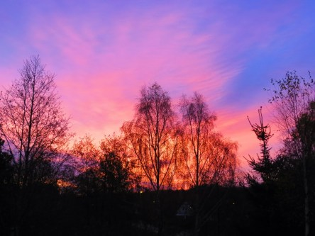

Idag går solen upp 07:54 och ned 17:33. Månen går upp 14:03 och ned 22:04 Månen är belyst 33 %. Dagens längd är 9 timmar och 39 minuter.

 Växlande molnighet 9,6 C  Vindby 2,8 m/s SE  Luftfuktighet 86 %  hPa 1006 Kl.01:55

 Växlande molnighet 8,8 C  Vindby 1,8 m/s ESE  Luftfuktighet 85 %  hPa 1007 Kl.07:55

 Växlande molnighet 13,6 C  Vindby 4,1 m/s W  Luftfuktighet 71 %  hPa 1006 Kl.14:00

 Växlande molnighet 6,9 C  Vindstilla  Luftfuktighet 94 %  hPa 1005 Kl.21:05

 

Högst och lägst uppmätta temperatur igår (inofficiellt privat mätare): Max 16,6 C , Min 8,1 C Högst uppmätta vind 5,1 m/s. Högst uppmätta vindby 8,2  m/s.

Högst och lägst uppmätta temperatur igår (officiellt enligt [YR.NO](http://www.vackertvader.se/v%C3%A4derstation/karlshamn?utm_source=email&utm_medium=email&utm_campaign=asarum)) Max 13,7 C, Min 8,6 C Högst uppmätta vind 4,6 m/s. Högst uppmätta vindby 11,9 m/s

 

 För första gången på länge fick man se en sparakande soluppgång.

Spara

Spara

Spara

Spara
