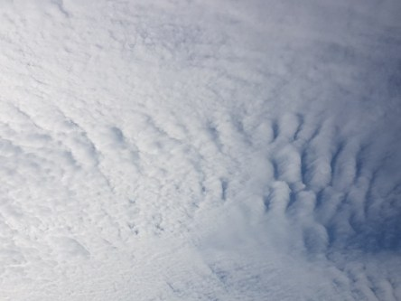

Idag går solen upp 06:52 och ned 18:50. Månen går upp 13:35 och ned 21:54 Månen är belyst 31 %. Dagens längd är 11 timmar och 58 minuter.

 Molnigt 12,4 C   Vindby 1,6 m/s SW  Luftfuktighet 97 %  hPa 1025 Kl.02:10

 Molnigt 12,4 C  Vindby 1,8 m/s SW  Luftfuktighet 99 %  hPa 1026 Kl.07:15

 En hel del moln 22,8 C  Vindby 4,8 m/s NNE  Luftfuktighet 59 %  hPa 1028 Kl.13:35

 Halvklart 11,3 C  Vindby 1,4 m/s W  Luftfuktighet 93 %  hPa 1028 Kl.21:15

 

Högst och lägst uppmätta temperatur igår (inofficiellt privat mätare): Max 23,2 C , Min 10,4 C Högst uppmätta vind 3,1 m/s. Högst uppmätta vindby 8 m/s.

Högst och lägst uppmätta temperatur igår (officiellt enligt [YR.NO](http://www.vackertvader.se/v%C3%A4derstation/karlshamn?utm_source=email&utm_medium=email&utm_campaign=asarum)) Max 19,5 C, Min 11,5 C Högst uppmätta vind 4,4 m/s. Högst uppmätta vindby 11,5 m/s

 

 Flera olika typer av moln idag. De två översta visar cirrocumulus eller makrillmoln. Det förkortas Cc. Den nedersta visar cumulus eller stackmoln. det förkortas Cu.

Spara

Spara

Spara

Spara

Spara
