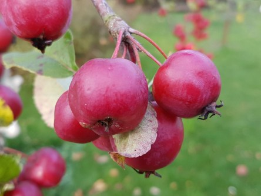

Idag går solen upp 07:56 och ned 17:31. Månen går upp 14:42 och ned 23:03 Månen är belyst 42 %. Dagens längd är 9 timmar och 35 minuter.

 Regn 8,6 C  Vindstilla  Luftfuktighet 98 %  hPa 1002  Regn 1,2 mm Kl.02:10

 Växlande molnighet 6,9 C  Vindby 1,4 m/s N  Luftfuktighet 97 %  hPa 1002  Regn 5,7 mm Kl.07:45

 Molnigt 7,6 C  Vindby 3,1 m/s SE  Luftfuktighet 82 %  hPa 1009 Kl.13:20

 Växlande molnighet 1,5 C  Vindstilla  Luftfuktighet 95 %   hPa 1010 Kl.20:10

 

Högst och lägst uppmätta temperatur igår (inofficiellt privat mätare): Max 15,2 C , Min 6,8 C Högst uppmätta vind 3,1 m/s. Högst uppmätta vindby 5,4  m/s.

Högst och lägst uppmätta temperatur igår (officiellt enligt [YR.NO](http://www.vackertvader.se/v%C3%A4derstation/karlshamn?utm_source=email&utm_medium=email&utm_campaign=asarum)) Max 13,2 C, Min 7,3 C Högst uppmätta vind 3,7 m/s. Högst uppmätta vindby 9,5 m/s

 

 Solen tittar fram mellan molnen och hösten börjar gå mot sitt slut. Snart är träden kala och gråa istället för färgsprakande.

Spara

Spara

Spara

Spara

Spara

Spara
