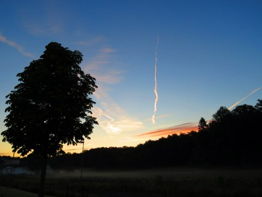

Idag går solen upp 04:53 och ned 21:19. Månen går upp 10:04 och ned 23:03 Månen är belyst 17 %. Dagens längd är 16 timmar och 26 minuter.

 Klart 9,2 C  Vindstilla  Luftfuktighet 98 %  hPa 1000 Kl.02:05

 Växlande molnighet 9,7 C  Vindstilla  Luftfuktighet 99 %  hPa 999 Kl.06:25

 Molnigt  24,8 C  Vindby 1,6 m/s E  Luftfuktighet 66 %  hPa 999 Kl.13:45

 Molnigt  18,7 C   Vindby 0,3 m/s NW  Luftfuktighet 79 %  hPa 999 Kl.20:20

 

Högst och lägst uppmätta temperatur igår (inofficiellt privat mätare): Max 26,8 C , Min 13,2 C Högst uppmätta vind 2,7 m/s. Högst uppmätta vindby 5,1 m/s.

Högst och lägst uppmätta temperatur igår (officiellt enligt [YR.NO](http://www.vackertvader.se/v%C3%A4derstation/karlshamn?utm_source=email&utm_medium=email&utm_campaign=asarum)) Max 22,6 C, Min 11,9 C Högst uppmätta vind 3,7 m/s. Högst uppmätta vindby 9,2 m/s

 

Spara

Spara

Spara

Spara
