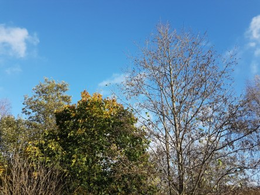

Idag går solen upp 07:58 och ned 17:29. Månen går upp 15:15 och ned 00:08 Månen är belyst 52 %. Dagens längd är 9 timmar och 31 minuter.

 Molnigt 5,9 C  Vindby 1,4 m/s ESE  Luftfuktighet 97 %  hPa 1002 Kl.02:05

 Mest molnigt 7,7 C  Vindby 5,2 m/s ESE  Luftfuktighet 85 %  hPa 994 Kl.07:05

 Växlande molnighet 13,5 C  Vindby 2,7 m/s E  Luftfuktighet 75 %  hPa 987  Regn 1 mm Kl.13:30

 Halvklart 5,3 C  Vindby 0,3 m/s N  Luftfuktighet 85 %  hPa 986 Kl.20:00

 

Högst och lägst uppmätta temperatur igår (inofficiellt privat mätare): Max 10,2 C , Min 1,5 C Högst uppmätta vind 2,7 m/s. Högst uppmätta vindby 4,4  m/s.

Högst och lägst uppmätta temperatur igår (officiellt enligt [YR.NO](http://www.vackertvader.se/v%C3%A4derstation/karlshamn?utm_source=email&utm_medium=email&utm_campaign=asarum)) Max 9,3 C, Min 2,7 C Högst uppmätta vind 3,8 m/s. Högst uppmätta vindby 8,3 m/s

 

 En härligt solig dag som omväxling.

Spara

Spara

Spara

Spara

Spara

Spara

Spara

Spara
