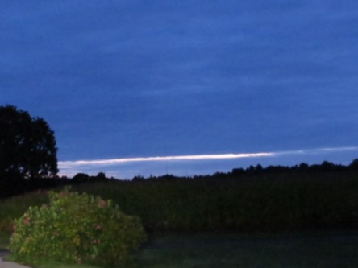

Idag går solen upp 05:55 och ned 20:07. Månen går upp 13:41 och ned 22:53 Månen är belyst 38 %. Dagens längd är 14 timmar och 12 minuter.

 Mest molnigt 11,9 C  Vindstilla  Luftfuktighet 97 %  hPa 1013 Kl.02:20

 Molnigt 12 C  Vindby 0,3 m/s W  Luftfuktighet 97 %  hPa 1014 KL.07:05

 Tunna slöjmoln 23,5 C  Vindby 2,4 m/s NW  Luftfuktighet 54 %  hPa 1016 Kl.12:50

 Mest molnigt 14,7 C  Vindby 0,8 m/s SE  Luftfuktighet 81 %  hPa 1015 Kl.20:00

 

Högst och lägst uppmätta temperatur igår (inofficiellt privat mätare): Max 25,9 C , Min 12,3 C Högst uppmätta vind 1 m/s. Högst uppmätta vindby 2 m/s.

Högst och lägst uppmätta temperatur igår (officiellt enligt [YR.NO](http://www.vackertvader.se/v%C3%A4derstation/karlshamn?utm_source=email&utm_medium=email&utm_campaign=asarum)) Max 21 C, Min 11,9 C Högst uppmätta vind ? m/s. Högst uppmätta vindby ? m/s

 

Spara

Spara

Spara

Spara

Spara
