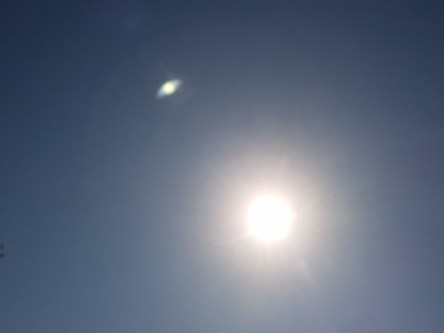

Idag går solen upp 06:56 och ned 18:44. Månen går upp 15:23 och ned 23:22 Månen är belyst 50 %. Dagens längd är 11 timmar och 48 minuter.

 Klart 10,3 C  Vindby 1,8 m/s SW  Luftfuktighet 98 %  hPa 1028 Kl.02:25

 Halvklart 11,1 C  Vindby 2,4 m/s SW  Luftfuktighet 97 %  hPa 1028 Kl.07:30

 Klart och blåsigt 20,8 C  Vindby 8,4 m/s NW  Luftfuktighet 54 %  hPa 1029 Kl.13:05

 Tunna slöjmoln 11,3 C  Vindby 2,4 m/s NW  Luftfuktighet 87 %  hPa 1027 Kl.20:00

 

Högst och lägst uppmätta temperatur igår (inofficiellt privat mätare): Max 21,5 C , Min 9,7 C Högst uppmätta vind 3,7 m/s. Högst uppmätta vindby 6,2 m/s.

Högst och lägst uppmätta temperatur igår (officiellt enligt [YR.NO](http://www.vackertvader.se/v%C3%A4derstation/karlshamn?utm_source=email&utm_medium=email&utm_campaign=asarum)) Max ? C, Min ? C Högst uppmätta vind ? m/s. Högst uppmätta vindby ? m/s

 

 Idag har det varit en härlig höstdag med klarblå himmel efter en fin soluppgång med tunna slöjmoln.

Spara

Spara

Spara

Spara

Spara

Spara
