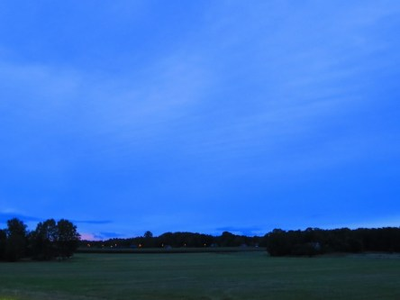

Idag går solen upp 06:05 och ned 19:54. Månen går upp 18:10 och ned 01:33 Månen är belyst 83 %. Dagens längd är 13 timmar och 49 minuter.

 Molnigt 10,7 C  Vindby 0,8 m/s S  Luftfuktighet 96 %  hPa 1013 Kl.02:30

 Tunna slöjmoln 10,3 C  Vindby 0,3 m/s N  Luftfuktighet 91 %  hPa 1012 Kl.07:00

 Molnigt 20,7 C  Vindby 1,6 m/s NE  Luftfuktighet 60 %  hPa 1013 Kl.13:25

 Växlande molnighet 11,2 C  Vindstilla  Luftfuktighet 97 %  hPa 1014  Regn 1 mm Kl.20:50

 

Högst och lägst uppmätta temperatur igår (inofficiellt privat mätare): Max 26,2 C , Min 6,9 C Högst uppmätta vind 2,4 m/s. Högst uppmätta vindby 5 m/s.

Högst och lägst uppmätta temperatur igår (officiellt enligt [YR.NO](http://www.vackertvader.se/v%C3%A4derstation/karlshamn?utm_source=email&utm_medium=email&utm_campaign=asarum)) Max 21,2 C, Min 11 C Högst uppmätta vind 2,9 m/s. Högst uppmätta vindby 5,7 m/s

 

Spara

Spara

Spara

Spara

Spara

Spara
