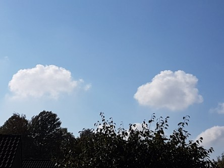

Idag går solen upp 06:58 och ned 18:42. Månen går upp 16:06 och ned 00:17 Månen är belyst 59 %. Dagens längd är 11 timmar och 44 minuter.

 Mest molnigt 10,5 C  Vindby 1,4 m/s W  Luftfuktighet 98 %  hPa 1026 Kl.02:30

 Tunna slöjmoln 10,2 C  Vindby 2 m/s SW  Luftfuktighet 98 %  hPa 1025 Kl.07:15

 Mest klart och blåsigt  20,2 C   Vindby 7,4 m/s NW  Luftfuktighet 58 %  hPa 1026 Kl.13:00

 Växlande molnighet 9,3 C  Vindby 0,7 m/s S  Luftfuktighet 85 %  hPa 1025 Kl.19:50

 

Högst och lägst uppmätta temperatur igår (inofficiellt privat mätare): Max 21,1 C , Min 10 C Högst uppmätta vind 1,7 (?) m/s. Högst uppmätta vindby 8,4 m/s.

Högst och lägst uppmätta temperatur igår (officiellt enligt [YR.NO](http://www.vackertvader.se/v%C3%A4derstation/karlshamn?utm_source=email&utm_medium=email&utm_campaign=asarum)) Max 17,3 C, Min 11,7 C Högst uppmätta vind 6,4 m/s. Högst uppmätta vindby 12,5 m/s

 

 Små härliga stackmoln, cumulus.

 Och en härligt blå himmel. Men snart tar hösten över på allvar med blåst och regn.

Spara

Spara

Spara

Spara

Spara
