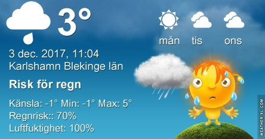

Idag går solen upp 08:11 och ned 15:28. Månen går upp 16:00 och ned 07:13 Månen är belyst 99 %. Dagens längd är 7 timmar och 17 minuter.

 Molnigt 2 C  Vindby 6,5 m/s N  Luftfuktighet 87 %  hPa 1013 Kl01:15

 Molnigt och blåsigt 2,4 C  Vindby 6,5 m/s NW  Luftfuktighet 94 %  hPa 1010 Kl.06:10

 Molnigt och en del regn 4,6 C  Vindby 5,2 m/s NW  Luftfuktighet 99 %  hPa 1006  Regn 1,2 mm Kl.12:35

 Växlande molnighet 2,6 C  Vindstilla  Luftfuktighet 99 %  hPa 1004  Regn 1,7 mm Kl.19:50

 

 

Högst och lägst uppmätta temperatur igår (inofficiellt privat mätare): Max 7,3 C , Min – 7,9 C Högst uppmätta vind 3 m/s. Högst uppmätta vindby 6 m/s.

Högst och lägst uppmätta temperatur igår (officiellt enligt [YR.NO](http://www.vackertvader.se/v%C3%A4derstation/karlshamn?utm_source=email&utm_medium=email&utm_campaign=asarum)) Max ? C, Min ? C Högst uppmätta vind ? m/s. Högst uppmätta vindby ? m/s

 

 Idag blir det bilder från vår grannstad Kristianstad. Nederst en vy in mot staden och överst Kristianstads Teaterhus.
