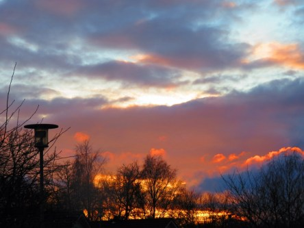

Idag går solen upp 08:06 och ned 15:31. Månen går upp 14:32 och ned 02:59 Månen är belyst 82 %. Dagens längd är 7 timmar och 25 minuter.

 Klart - 5,3 C  Vindstilla  Luftfuktighet 92 %  hPa 998 Kl.01:30

 Ökande molnighet - 3 C  Vindstilla  Luftfuktighet 93 %  hPa 997 Kl.06:45

 Mest molnigt 2,7 C  Vindby 1 m/s NW  Luftfuktighet 97 %  hPa 999  Regn 6,5 mm Kl.14:55

 Växlande molnighet 1,1 C  Vindby 0,6 m/s W  Luftfuktighet 98 %  hPa 1002  Regn 7 mm Kl.19:50

 

Högst och lägst uppmätta temperatur igår (inofficiellt privat mätare): Max 5,6 C , Min - 4 C Högst uppmätta vind 3,4 m/s. Högst uppmätta vindby 4,8 m/s.

Högst och lägst uppmätta temperatur igår (officiellt enligt [YR.NO](http://www.vackertvader.se/v%C3%A4derstation/karlshamn?utm_source=email&utm_medium=email&utm_campaign=asarum)) Max 5,1 C, Min - 3,9 C Högst uppmätta vind 1,8 m/s. Högst uppmätta vindby 5,2 m/s

 

 Det blev en vacker solnedgång idag efter snöblasket på dagen.
