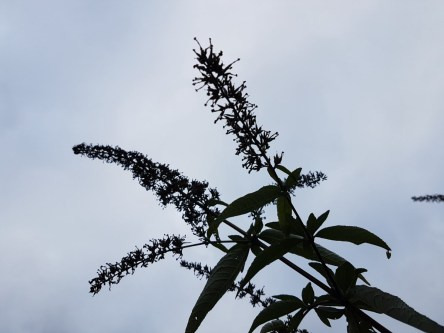

Idag går solen upp 07:11 och ned 16:15. Månen går upp 16:31 och ned 05:31 Månen är belyst 98 %. Dagens längd är 9 timmar och 4 minuter.

 Växlande molnighet 2,7 C  Vindstilla  Luftfuktighet 98 %  hPa 1005 Kl.02:15

 Mest klart - 1,5 C  Vindstilla  Luftfuktighet 96 %  hPa 1006 Kl.06:45

 Molnigt 11,4 C  Vindby 3 m/s SE  Luftfuktighet 75 %  hPa 1007 Kl.13:25

 Molnigt 7,3 C  Vindby 0,7 m/s N  Luftfuktighet 80 %  hPa 1007 Kl.20:00

 

Högst och lägst uppmätta temperatur igår (inofficiellt privat mätare): Max 14,5 C , Min 4,3 C Högst uppmätta vind 2,4 m/s. Högst uppmätta vindby 4,4 m/s.

Högst och lägst uppmätta temperatur igår (officiellt enligt [YR.NO](http://www.vackertvader.se/v%C3%A4derstation/karlshamn?utm_source=email&utm_medium=email&utm_campaign=asarum)) Max 11,5 C, Min 5,6 C Högst uppmätta vind 3,2 m/s. Högst uppmätta vindby 7,4 m/s

 

 En svag glimt av ljusare himmel idag.

Spara

Spara

Spara

Spara
