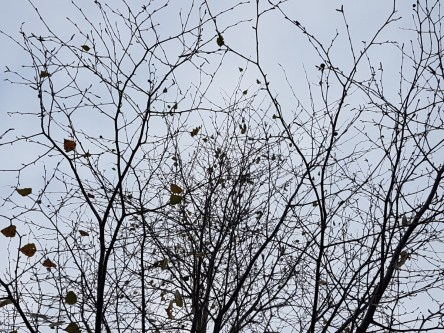
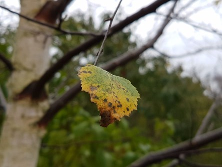

Idag går solen upp 07:05 och ned 16:22. Månen går upp 15:27 och ned 01:32 Månen är belyst 79 %. Dagens längd är 9 timmar och 17 minuter.

 Klart - 4,6 C  Vindby 0,7 m/s W  Luftfuktighet 81 %  hPa 1013 Kl.02:00

 Klart - 5,6 C  Vindstilla  Luftfuktighet 84 %  hPa 1012 Kl.06:25

 Molnigt 9,3 C  Vindby 3,6 m/s E  Luftfuktighet 70 %  hPa 1011 Kl.13:40

 Molnigt 5,6 C  Vindby 1 m/s NW   Luftfuktighet 87 %  hPa 1010 Kl.21:20

 

Högst och lägst uppmätta temperatur igår (inofficiellt privat mätare): Max 9,8 C , Min - 3,8 C Högst uppmätta vind 3,7 m/s. Högst uppmätta vindby 7,4 m/s.

Högst och lägst uppmätta temperatur igår (officiellt enligt [YR.NO](http://www.vackertvader.se/v%C3%A4derstation/karlshamn?utm_source=email&utm_medium=email&utm_campaign=asarum)) Max 6,1 C, Min - 1,8 C Högst uppmätta vind 5,2 m/s. Högst uppmätta vindby 12,2 m/s

 

 Snart är alla löv fallna. Bara kala grenar kvar.

Spara

Spara

Spara

Spara
