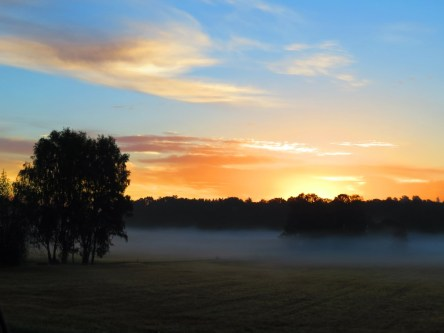

Idag går solen upp 05:00 och ned 21:12. Månen går upp 14:49 och ned 00:25 Månen är belyst 54 %. Dagens längd är 16 timmar och 12 minuter.

 Molnigt 15 C  Vindby 0,3 m/s W  Luftfuktighet 98 %  hPa 1004 Kl.01:45

 Växlande molnighet  15,3 C  Vindstilla Luftfuktighet 99 %  hPa 1006 Kl.06:50

 Växlande molnighet 25 C  Vindby 3,6 m/s NNW  Luftfuktighet 51 %  hPa 1009  UV 3 Kl.14:05

 Tunna slöjmoln  18,4 C  Vindby 1,4 m/s NW  Luftfuktighet 75 %  hPa 1010 Kl.20:00

 

Högst och lägst uppmätta temperatur igår (inofficiellt privat mätare): Max 22,3 C , Min 9,2 C Högst uppmätta vind 1,4 m/s. Högst uppmätta vindby 2,7 m/s.

Högst och lägst uppmätta temperatur igår (officiellt enligt [YR.NO](http://www.vackertvader.se/v%C3%A4derstation/karlshamn?utm_source=email&utm_medium=email&utm_campaign=asarum)) Max 18,7 C, Min 7,6 C Högst uppmätta vind 4,5 m/s. Högst uppmätta vindby 8,3 m/s

 

Spara

Spara

Spara

Spara

Spara
