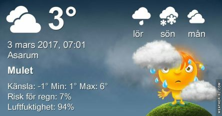

 _Molnigt och lätt regn på morgonen. Det blir fortsatt molnigt och omkring 5 plusgrader under resten av veckan och början på nästa vecka. Måndag och Tisdag sjunker temperaturen till någon enstaka plusgrad på dagen och några minus på natten._
