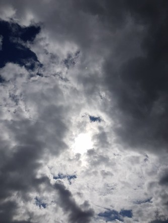

Idag går solen upp 06:07 och ned 19:51. Månen går upp 18:44 och ned 02:32 Månen är belyst 89 %. Dagens längd är 13 timmar och 44 minuter.

 Växlande molnighet 9,4 C  Vindstilla  Luftfuktighet 99 %  hPa 1013 Kl.01:10

 Växlande molnighet 15,5 C  Vindby 0,7 m/s SE  Luftfuktighet 97 %  hPa 1011 Kl.08:00

 Mest molnigt 20,4 C  Vindby 3,6 m/s SE  Luftfuktighet 58 %  hPa 1010 Kl.13:40

 Mest molnigt 13,5 C  Vindby 4,8 m/s E  Luftfuktighet 79 %  hPa 1008 Kl.20:00

 

Högst och lägst uppmätta temperatur igår (inofficiellt privat mätare): Max 20,7 C , Min 8,5 C Högst uppmätta vind 2,7 m/s. Högst uppmätta vindby 4,4 m/s.

Högst och lägst uppmätta temperatur igår (officiellt enligt [YR.NO](http://www.vackertvader.se/v%C3%A4derstation/karlshamn?utm_source=email&utm_medium=email&utm_campaign=asarum)) Max 17,8 C, Min 8,4 C Högst uppmätta vind 3,2 m/s. Högst uppmätta vindby 6,9 m/s

 

Spara

Spara

Spara

Spara
