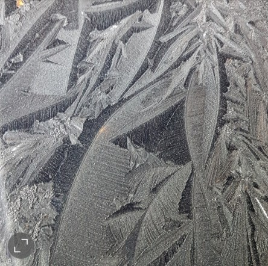
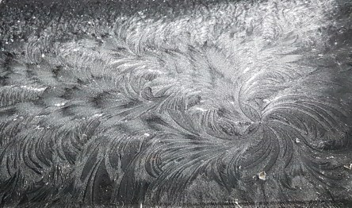
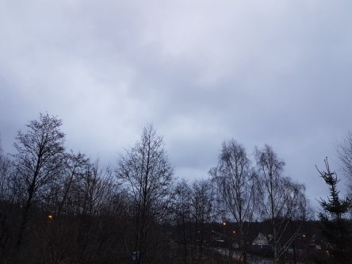

Idag går solen upp 08:14 och ned 15:27. Månen går upp 17:46 och ned 09:46 Månen är belyst 97 %. Dagens längd är 7 timmar och 13 minuter.

 Klart - 6 C  Vindstilla  Luftfuktighet 91 %  hPa 1014 Kl.01:45

 Molnigt - 0,4 C  Vindstilla  Luftfuktighet 96 %  hPa 1011 Kl.07:20

 Molnigt 7,9 C  Vindby 4,8 m/s NE  Luftfuktighet 91 %  hPa 1007  Regn 0,5 mm Kl.15:00

 Duggregn 7,2 C  Vindby 1,6 m/s SE  Luftfuktighet 96 %  hPa 1007 Kl.21:40

 

 

Högst och lägst uppmätta temperatur igår (inofficiellt privat mätare): Max 4,7 C , Min – 0,4 C Högst uppmätta vind 3,1 m/s. Högst uppmätta vindby 6,5 m/s.

Högst och lägst uppmätta temperatur igår (officiellt enligt [YR.NO](http://www.vackertvader.se/v%C3%A4derstation/karlshamn?utm_source=email&utm_medium=email&utm_campaign=asarum)) Max ? C, Min ? C Högst uppmätta vind ? m/s. Högst uppmätta vindby ? m/s

 

 Från en kall natt med konstverk som naturen skapat till ett betydligt gråare och mildare väder.
