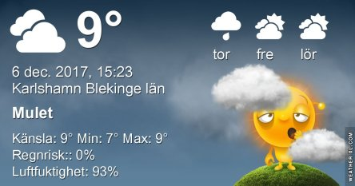

Idag går solen upp 08:15 och ned 15:26. Månen går upp 18:56 och ned 10:43 Månen är belyst 92 %. Dagens längd är 7 timmar och 11 minuter.

 Molnigt 7,6 C  Vindby 2,8 m/s SE  Luftfuktighet 97 %  hPa 1007 Kl.02:30

 Molnigt 7,3 C  Vindby 3,1 m/s E  Luftfuktighet 95 %  hPa 1006  Regn 1,2 mm Kl.07:15

 Molnigt 9,1 C  Vindby 3,8 m/s SE  Luftfuktighet 93 %  hPa 1005 Kl.14:15

 Molnigt 7,8 C  Vindby 3,4 m/s SE  Luftfuktighet 95 %  hPa 1006 Kl.20:00

 

 

Högst och lägst uppmätta temperatur igår (inofficiellt privat mätare): Max 8,3 C , Min – 6 C Högst uppmätta vind 3,7 m/s. Högst uppmätta vindby 6,8 m/s.

Högst och lägst uppmätta temperatur igår (officiellt enligt [YR.NO](http://www.vackertvader.se/v%C3%A4derstation/karlshamn?utm_source=email&utm_medium=email&utm_campaign=asarum)) Max 7,9 C, Min ? C Högst uppmätta vind 3,9 m/s. Högst uppmätta vindby 10,1 m/s

 

 Milt, blåsigt och väldigt grått och trist väder idag.
