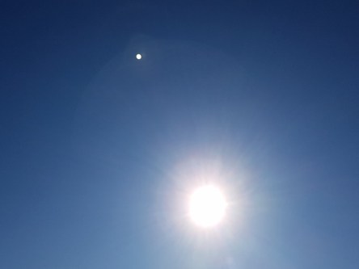

Idag går solen upp 07:12 och ned 18:23. Månen går upp 19:07 och ned 07:37 Månen är belyst 100 %. Dagens längd är 11 timmar och 11 minuter.

 Klart 2,3 C  Vindby 0,8 m/s E  Luftfuktighet 98 %  hPa 992 Kl.02:25

 Tunna slöjmoln - 0,3 C  Vindstilla  Luftfuktighet 96 %  hPa 993 Kl.06:25

 Mest klart 18,9 C  Vindby 3,8 m/s SW  Luftfuktighet 45 %  hPa 998 Kl.13:35

 Mest klart 5,3 C  Vindstilla  Luftfuktighet 87 %  hPa 1002 Kl.19:50

 

Högst och lägst uppmätta temperatur igår (inofficiellt privat mätare): Max 15,5 C , Min 4,2 C Högst uppmätta vind 3,1 m/s. Högst uppmätta vindby 5,4 m/s.

Högst och lägst uppmätta temperatur igår (officiellt enligt [YR.NO](http://www.vackertvader.se/v%C3%A4derstation/karlshamn?utm_source=email&utm_medium=email&utm_campaign=asarum)) Max 13,4 C, Min 5,9 C Högst uppmätta vind 2,8 m/s. Högst uppmätta vindby 7,6 m/s

 

 Blå himmel och sol större delen av dagen.

Spara

Spara

Spara
