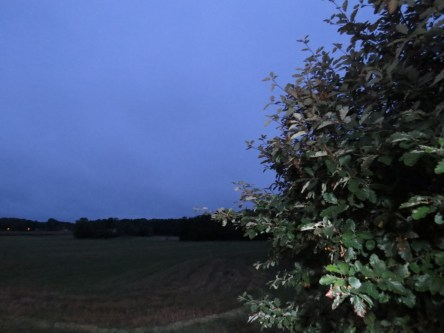

Idag går solen upp 06:13 och ned 19:43. Månen går upp 20:00 och ned 06:03 Månen är belyst 100 %. Dagens längd är 13 timmar och 30 minuter.

 Molnigt 14,2 C  Vindstilla  Luftfuktighet 99 %  hPa 1011 Kl.02:05

 Molnigt 13,9 C  Vindby 1,6 m/s NW  Luftfuktighet 99 %  hPa 1008 Kl.06:45

 Molnigt 14,8 C  Vindby 3,4 m/s SE  Luftfuktighet 99 %  hPa 1005 Kl.13:10

 Molnigt 11,7 C  Vindby 4,8 m/s E  Luftfuktighet 97 %  hPa 1003  Regn 3,2 mm Kl.19:50

 

Högst och lägst uppmätta temperatur igår (inofficiellt privat mätare): Max 19,2 C , Min 12 C Högst uppmätta vind 2 m/s. Högst uppmätta vindby 3,7 m/s.

Högst och lägst uppmätta temperatur igår (officiellt enligt [YR.NO](http://www.vackertvader.se/v%C3%A4derstation/karlshamn?utm_source=email&utm_medium=email&utm_campaign=asarum)) Max 19 C, Min 14,2 C Högst uppmätta vind 2,4 m/s. Högst uppmätta vindby 6,2 m/s

 

Spara

Spara

Spara
