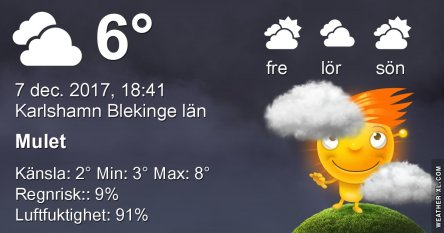

Idag går solen upp 08:17 och ned 15:26. Månen går upp 20:14 och ned 11:28 Månen är belyst 84 %. Dagens längd är 7 timmar och 9 minuter.

Blåsigt 7,5 C Vindby 7,5 m/s N  Luftfuktighet 85 %  hPa 1004 Kl.02:15

 Molnigt 6,8 C  Vindby 5 m/s ESE  Luftfuktighet 83 %  hPa 1002 Kl.07:20

 Molnigt 6,3 C  Vindby 4,4 m/s E  Luftfuktighet 83 %  hPa 998  Regn 0,5 mm Kl.13:50

 Molnigt 4,7 C  Vindby 4,6 m/s ENE  Luftfuktighet 97 %  hPa 992  Regn 1,5 mm Kl.20:00

 

 

Högst och lägst uppmätta temperatur igår (inofficiellt privat mätare): Max 9,1 C , Min 7,2 C Högst uppmätta vind 5,1 m/s. Högst uppmätta vindby 7 ,1 m/s.

Högst och lägst uppmätta temperatur igår (officiellt enligt [YR.NO](http://www.vackertvader.se/v%C3%A4derstation/karlshamn?utm_source=email&utm_medium=email&utm_campaign=asarum)) Max 8,7 C, Min 7 C Högst uppmätta vind 3,8 m/s. Högst uppmätta vindby 10,3 m/s

 

 Nu när det är så grått, kallt och trist passar det bra med lite sommarminnen istället. Snart ser det ut så här igen.
