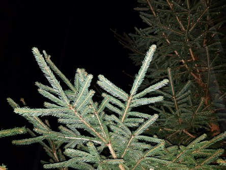

Idag går solen upp 07:14 och ned 18:21. Månen går upp 19:31 och ned 09:00 Månen är belyst 98 %. Dagens längd är 11 timmar och 7 minuter.

 Klart 1 C  Vindstilla  Luftfuktighet 94 %  hPa 1003 Kl.01:50

 Tunna slöjmoln 0,5 C  Vindstilla  Luftfuktighet 97 %  hPa 1001 Kl.06:30

 Molnigt 12,2 C  Vindby 4,8 m/s NW  Luftfuktighet 70 %  hPa 999 Kl.13:25

 Regn 8,7 C  Vindstilla  Luftfuktighet 99 %  hPa 993  Regn 6,3 mm Kl.19:50

 

Högst och lägst uppmätta temperatur igår (inofficiellt privat mätare): Max 20,6 (i solen) C , Min - 0,7 C Högst uppmätta vind 2 m/s. Högst uppmätta vindby 3,7 m/s.

Högst och lägst uppmätta temperatur igår (officiellt enligt [YR.NO](http://www.vackertvader.se/v%C3%A4derstation/karlshamn?utm_source=email&utm_medium=email&utm_campaign=asarum)) Max 15,1 C, Min 1,5 C Högst uppmätta vind 3,9 m/s. Högst uppmätta vindby 9,1 m/s

 

 Mörkt tidigt, regn och kalla nätter. Det kallas höst.

Spara

Spara

Spara

Spara

Spara

Spara

Spara
