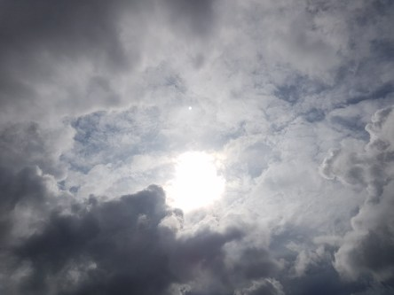

Idag går solen upp 06:15 och ned 19:40. Månen går upp 20:21 och ned 07:20 Månen är belyst 99 %. Dagens längd är 13 timmar och 25 minuter.

 Regn 11,3 C  Vindby 2,8 m/s NW  Luftfuktighet 98 %  hPa 1000  Regn 0,5 mm Kl.02:10

 Regn 10,8 C  Vindby 4,8 m/s WSW  Luftfuktighet 98 %  hPa 1000  Regn 1,5 mm Kl.06:50

 Mest molnigt, någon solglimt  20 C  Vindby  2 m/s NW  Luftfuktighet 76 %  hPa 1002  Regn 2,7 mm Kl.14:05

 Molnigt 12,3 C  Vindstilla  Luftfuktighet 95 %  hPa 1003 Kl.20:00

 

Högst och lägst uppmätta temperatur igår (inofficiellt privat mätare): Max 15,2 C , Min 11 C Högst uppmätta vind 2,7 m/s. Högst uppmätta vindby 7,8 m/s.

Högst och lägst uppmätta temperatur igår (officiellt enligt [YR.NO](http://www.vackertvader.se/v%C3%A4derstation/karlshamn?utm_source=email&utm_medium=email&utm_campaign=asarum)) Max 14,2 C, Min 10,9 C Högst uppmätta vind 3,8 m/s. Högst uppmätta vindby 9,4 m/s

 

Spara

Spara

Spara

Spara

Spara
