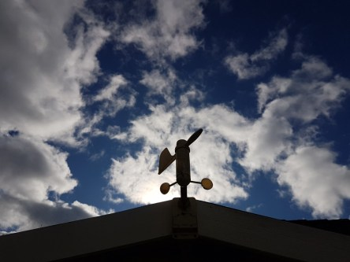

Idag går solen upp 07:16 och ned 18:18. Månen går upp 20:00 och ned 10:23 Månen är belyst 93 %. Dagens längd är 11 timmar och 2 minuter.

 Tunna slöjmoln 5 C  Vindby 0,3 E  Luftfuktighet 98 %  hPa 993 Kl.01:30

 Molnigt 4,5 C  Vindby 2,6 m/s SW  Luftfuktighet 99 %   hPa 997 Kl.08:00

 Växlande molnighet 12,2 C  Vindby 2,4 m/s NW  Luftfuktighet 63 %  hPa 1002 Kl.14:00

 Klart 5,1 C  Vindby 2,2 m/s S  Luftfuktighet 79 %  hPa 1004 Kl.20:05

 

Högst och lägst uppmätta temperatur igår (inofficiellt privat mätare): Max 12,8 C , Min – 0,2 C Högst uppmätta vind 3,1 m/s. Högst uppmätta vindby 4,8 m/s.

Högst och lägst uppmätta temperatur igår (officiellt enligt [YR.NO](http://www.vackertvader.se/v%C3%A4derstation/karlshamn?utm_source=email&utm_medium=email&utm_campaign=asarum)) Max 11,6 C, Min 1,2 C Högst uppmätta vind 3,1 m/s. Högst uppmätta vindby 9,8 m/s

 

 Mycket cumulusmoln eller stackmoln idag. Kallt och höstlikt.

Spara

Spara

Spara
