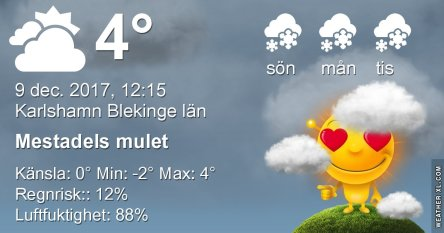
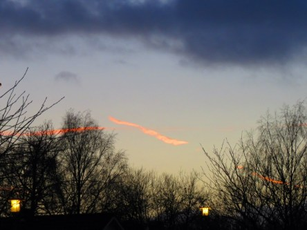

Idag går solen upp 08:19 och ned 15:25. Månen går upp 22:53 och ned 12:28 Månen är belyst 64 %. Dagens längd är 7 timmar och 6 minuter.

Växlande molnighet 0 C  Vindby 2,2 m/s ESE  Luftfuktighet 83 %   hPa 988 Kl.02:35

 Blåsigt 1,5 C  Vindby 8,2 m/s E  Luftfuktighet 88 %  hPa 987 Kl.06:30

 Regn 6 C  Vindby 5,8 m/s NW   Luftfuktighet 78 %  hPa 988 Regn 0,5 mm Kl.13:00

 Klart - 0,4 C  Vindby 1,2 m/s SE  Luftfuktighet 82 %  hPa 991 Kl.19:50

 

 Äntligen lördag!

 

Högst och lägst uppmätta temperatur igår (inofficiellt privat mätare): Max 6,7 C , Min 0.9 C Högst uppmätta vind 4,4 m/s. Högst uppmätta vindby 6,8 m/s.

Högst och lägst uppmätta temperatur igår (officiellt enligt [YR.NO](http://www.vackertvader.se/v%C3%A4derstation/karlshamn?utm_source=email&utm_medium=email&utm_campaign=asarum)) Max 5,4 C, Min 2,4 C Högst uppmätta vind 2,9 m/s. Högst uppmätta vindby 10,4 m/s

 

 Blåsigt, mycket moln och milt idag.
