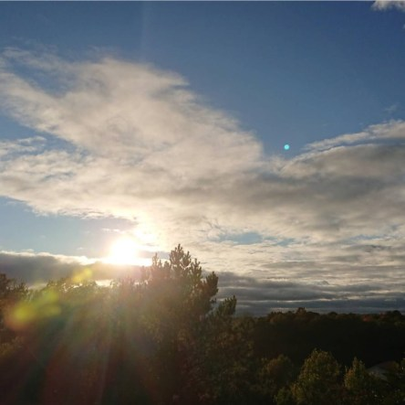

Idag går solen upp 07:18 och ned 18:15. Månen går upp 20:35 och ned 11:44 Månen är belyst 86 %. Dagens längd är 10 timmar och 57 minuter.

 Klart 3,1 C  Vindby 2,6 m/s S  Luftfuktighet 85 %  hPa 1003 Kl.02:15

 Klart 2,6 C  Vindby 2 m/s SW  Luftfuktighet 88 %  hPa 1002 Kl.07:00

 Molnigt10,5 C  Vindby 4 m/s SE  Luftfuktighet 67 %  hPa 1004 Kl.13:25

 Mest molnigt 6,5 C  Vindby 1,4 m/s E  Luftfuktighet 80 %  hPa 1005 Kl.19:55

 

Högst och lägst uppmätta temperatur igår (inofficiellt privat mätare): Max 12,8 C , Min 3,5 C Högst uppmätta vind 3,7 m/s. Högst uppmätta vindby 5,1 m/s.

Högst och lägst uppmätta temperatur igår (officiellt enligt [YR.NO](http://www.vackertvader.se/v%C3%A4derstation/karlshamn?utm_source=email&utm_medium=email&utm_campaign=asarum)) Max 9,3 C, Min 2,9 C Högst uppmätta vind 4,4 m/s. Högst uppmätta vindby 10,8 m/s

 

 En härlig solnedgång efter en mestadels molnig dag.

Spara

Spara

Spara

Spara
