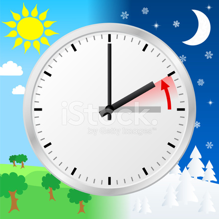

**Vintertid, normaltid Höst 2017**

_Nu är det dags att ställa om klockan igen. Den här gången vrider vi tillbaka den och får tillbaka den timme vi förlorade i våras. Kl.03:00 inatt mellan lördag och söndag ställer vi visaren på 02:00 istället._

 _Den som vill får gärna lämna en kommentar om vad ni tycker om det här med sommar och vintertid._

Spara

Spara
