**Till minne av 9/11 i New York**

_Varje år den 11 september tänker jag på alla de människor som fick sätta livet till i detta vansinniga dåd i New York. Och efter att ha besökt Ground Zero två gånger så har det blivit mer verkligt hur många människor som dog den dagen. Bakom alla dessa namn som finns inristade på kanterna runt fontänerna fanns en människa som hade ett liv och som aldrig kunde ana att detta skulle bli deras sista dag i livet. Här är några bilder som jag tog i somras när vi var i New York._

[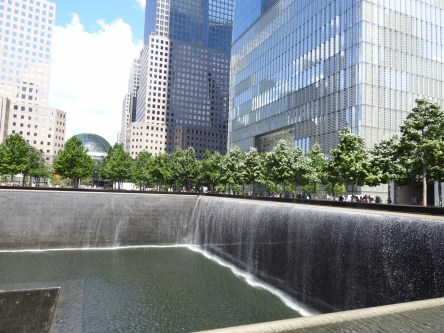](https://worldwideweatherblog.wordpress.com/wp-content/uploads/2018/09/dscn5690-1600x1200.jpg)

[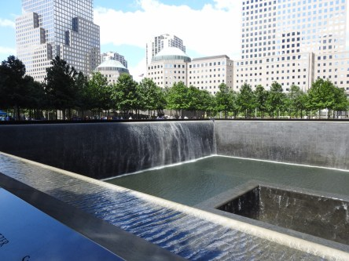](https://worldwideweatherblog.wordpress.com/wp-content/uploads/2018/09/dscn5691-1600x1200.jpg)

[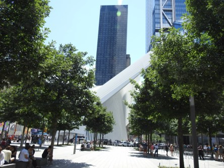](https://worldwideweatherblog.wordpress.com/wp-content/uploads/2018/09/dscn5693-1600x1200.jpg)

 

[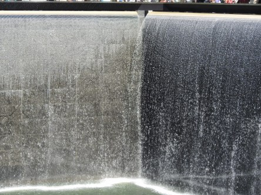](https://worldwideweatherblog.wordpress.com/wp-content/uploads/2018/09/dscn5698-1600x1200.jpg)

[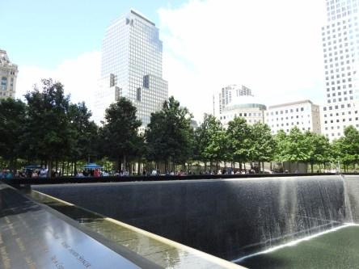](https://worldwideweatherblog.wordpress.com/wp-content/uploads/2018/09/dscn5700-1600x1200.jpg)

[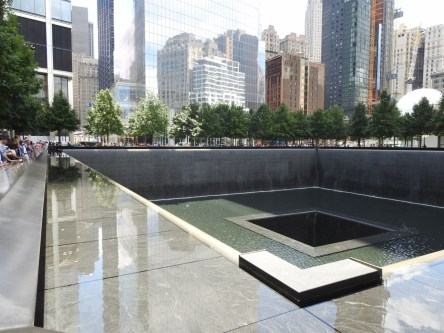](https://worldwideweatherblog.wordpress.com/wp-content/uploads/2018/09/dscn5708-1600x1200.jpg)

[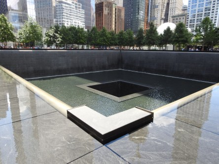](https://worldwideweatherblog.wordpress.com/wp-content/uploads/2018/09/dscn5710-1600x1200.jpg)

[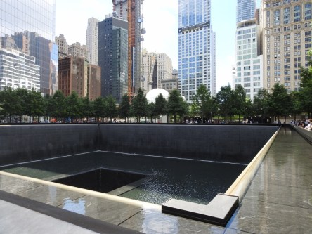](https://worldwideweatherblog.wordpress.com/wp-content/uploads/2018/09/dscn5712-1600x1200.jpg)

[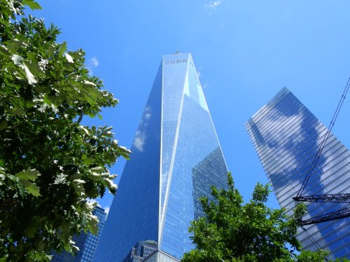](https://worldwideweatherblog.wordpress.com/wp-content/uploads/2018/09/dscn1404-1600x1200.jpg)

[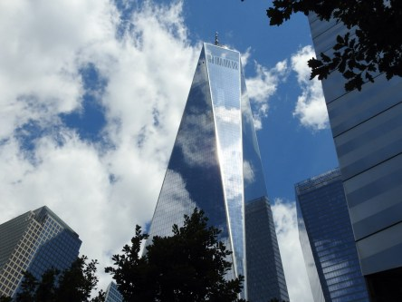](https://worldwideweatherblog.wordpress.com/wp-content/uploads/2018/09/dscn1418-1600x1200.jpg)

[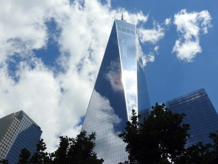](https://worldwideweatherblog.wordpress.com/wp-content/uploads/2018/09/dscn1419-1600x1200.jpg)

_Läs mer om attackerna [här](https://sv.wikipedia.org/wiki/11_september-attackerna)_
