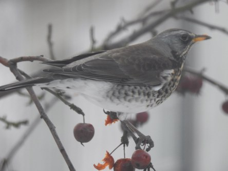
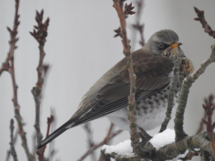
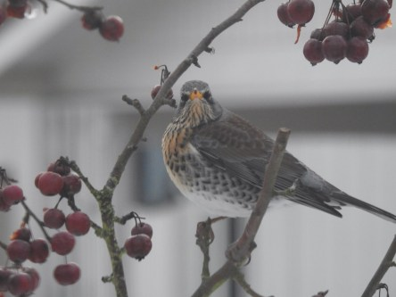
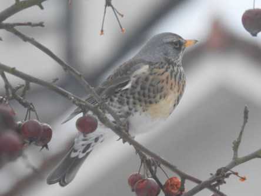
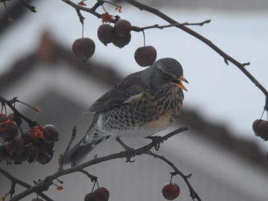

**Idag fick vi fint besök**

_Två björktrastar kom på besök idag och mumsade på våra prydnadsäpplen._

 _De flesta bilderna är tagna genom köksfönstret så de är lite gråa i tonen. Några lyckades jag smyga ut och ta utan att skrämma bort dem._
