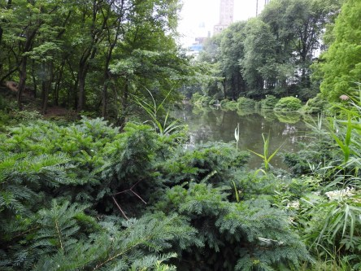
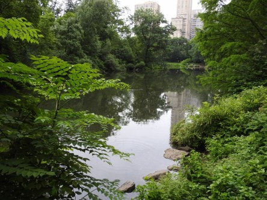
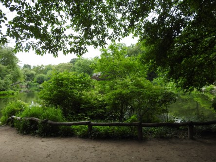
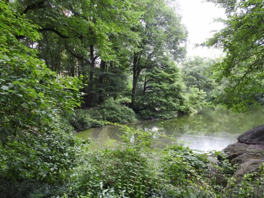
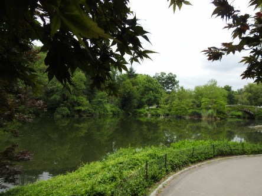
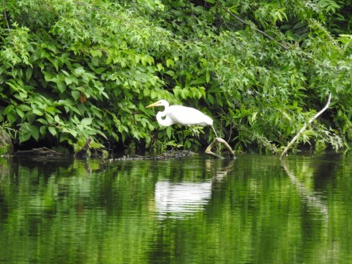
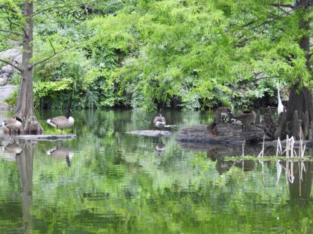
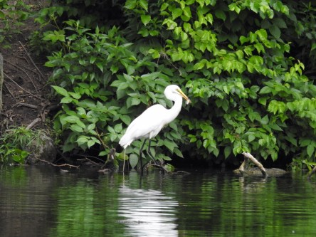
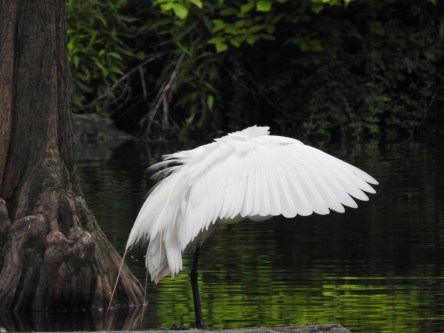
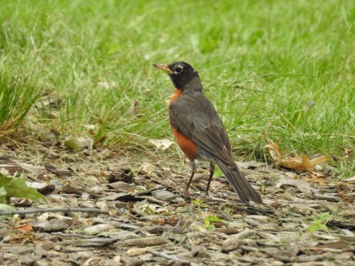

**En andningspaus mitt i storstadsstressen.**

_Att komma ut till Central Park är en underbar upplevelse. Det är så lugnt och skönt och man märker ingenting av storstaden och det höga tempot där. Man kan njuta av vacker natur och smådjursliv. På grund av allt vackert som finns här så får det bli mer än ett inlägg, för det hade blivit alldeles för långt annars. Bilderna kommer i den ordning jag tog dem när vi gick runt i parken._

 _Härlig grönska och vatten. Det är så lugnande att gå här._

 _Änderna simmar i vattnet._

 _En gråsparv tar en paus._

 _Promenaden fortsätter längs sjön._

 _Hägern och kanadagässen kopplar av och letar efter mat i sjön._

 _Långt borta ser man storstaden._

 _En vandringstrast står och funderar på vad han ska ha till middag._

 _Hungriga och nyfikna ekorrar är det gott om här._

 _En ung vandringstrast kopplar av i trädet._

 _Vi hamnade i rena labyrinten här och höll knappt på att hitta ut igen. Alla vägar var återvändsgränder kändes det som._

 _Ännu en återvändsgränd._

 _Ekorren undrar nog vad vi håller på med som vandrar runt i cirklar._

_Fortsättning följer..._
