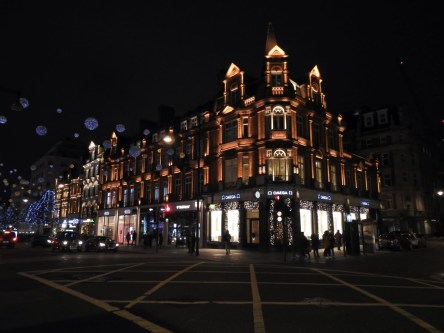
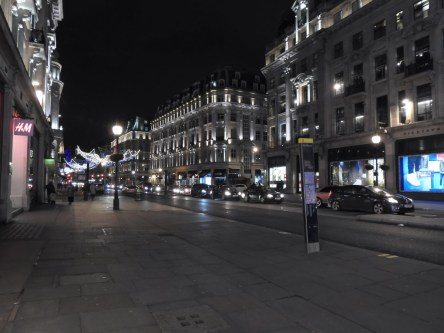
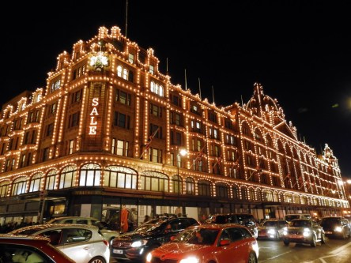
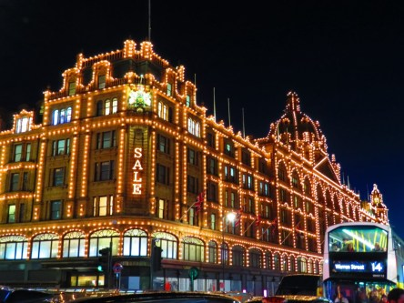
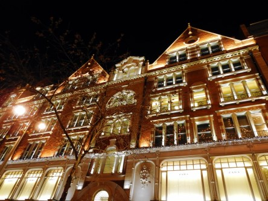
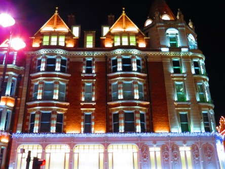
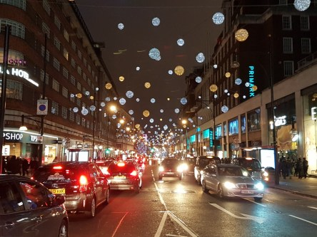
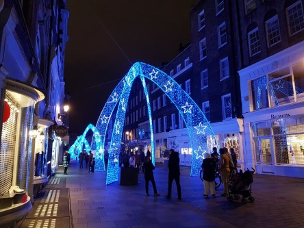

**London by night**

_Hela London lyser och glittrar så här års. Här är ett litet axplock från allt som lyser upp denna stad i vintermörkret._

 _Skyltar som lyser._

 _Byggnader som lyser._

 _Gränder och gator som lyser._
