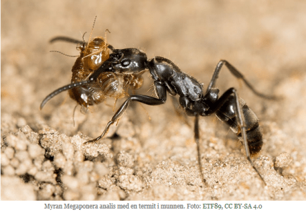

## Myror vårdar skadade kamrater

februari 14, 2018

 

 

**Forskare har kommit fram till att myrorna _Megaponera analis_ använder sig av ”sjukvårdare” som tar hand om skadade kamrater och deras sår. Åtminstone om inte skadorna är alltför allvarliga. Då lämnas de nämligen till sina öden.**

_Megaponera analis_ jagar och äter termiter. Efter att scouter hittat ett termitbo samlas 200-500 myror och går till attack i formation med tre myror i rad. En strid mellan myrorna och termiterna bryter ut, men myrorna brukar vinna efter ungefär 20 minuter enligt biologen Erik Frank, som studerat myrornas beteende.

**LÄS ÄVEN**: • [Myrorna som bär hem skadade artfränder](http://www.natursidan.se/nyheter/myrorna-som-bar-hem-skadade-artfrander/)

Tidigare har han också kunnat följa hur skadade myror ”skriker på en sjukvårdare” genom att utsöndra ett kemiskt ämne som gör att andra myror plockar med sig dem hem. Åtminstone om inte myrorna är alltför skadade, då lämnas de nämligen kvar.

I sin nya studie har Erik Frank visat att skadade myror får vård av friska kamrater. Deras öppna sår sköts om med myrornas käkar och enligt studien levde 90 procent av de behandlade myrorna efter 24 timmar medan enbart 20 procent överlevde om hjälpen förhindrades.

**LÄS ÄVEN**: • [Insekter medicinerar sig själva](http://www.natursidan.se/nyheter/insekter-medicinerar-sig-sjalva/)

Exakt vad det är för vård myrorna ger är oklart, men troligen avlägsnar de smuts och lägger på antimikrobiella ämnen som skyddar såren mot infektioner.

**LÄS ÄVEN**: • [Naturfilm: Myror odlar svamp](http://www.natursidan.se/nyheter/naturfilm-myror-odlar-svamp/)

Myrorna räddar på det här sättet lika många myror som föds varje dag i myrstacken. Det blir därmed ännu fler myror som kan samla föda till kolonin.

**LÄS ÄVEN**: • [Myror bygger flotte av sina unga vid översvämning](http://www.natursidan.se/nyheter/myror-bygger-flotte-for-att-radda-drottning-vid-oversvamning/)

Men Erik Frank [poängterar för radioshowen KUNC](http://www.kunc.org/post/no-ant-left-behind-warrior-ants-carry-injured-comrades-home) att det skiljer sig en del från hur mänskliga soldater kallar på sjukvårdare. Myrorna hjälper helt enkelt varandra hem eftersom de skadade artfränder utsöndrar en kemisk signal. Det handlar inte om empati. Däremot gynnar beteendet kolonins överlevnad.

Källor: [Science Mag](http://www.sciencemag.org/news/2018/02/watch-these-african-ants-treat-comrades-injured-field-battle) och [NPR](http://www.kunc.org/post/no-ant-left-behind-warrior-ants-carry-injured-comrades-home)

Artikeln hämtad och kopierad från [Natursidan](http://www.natursidan.se/nyheter/myror-vardar-skadade-kamrater/)

Jag tycker detta är helt otroligt.
