**Loch Ness och vidare till Inverness**

_I dagens inlägg gör vi ytterligare ett besök vid Loch Ness och Fort Augustus, nu med vår nya guide Audry. Efter att vi vandrat runt i den lilla byn för andra gången på samma dag så går färden vidare till Inverness där vi övernattar innan vi åker mot Orkney._

[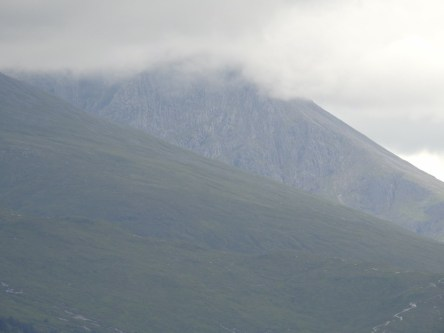](https://worldwideweatherblog.wordpress.com/wp-content/uploads/2018/02/dscn8556-desktop-resolution.jpg) _Vårt första stopp blir vid Ben Nevis, andra gången den här resan för vår del av gruppen. [Ben Nevis](https://sv.wikipedia.org/wiki/Ben_Nevis) är Storbritanniens högsta berg. Toppen på berget är så gott som alltid dolt i moln och dimma._  _Ben Nevis är det som ligger näst längst bort och som ser minst ut på grund av att molnen täcker hela toppen._

[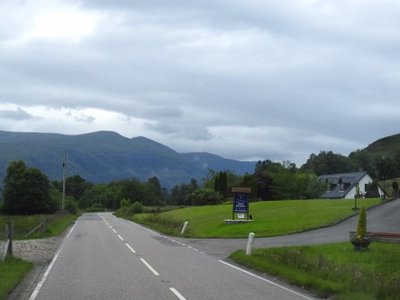](https://worldwideweatherblog.wordpress.com/wp-content/uploads/2018/02/dscn8563-desktop-resolution.jpg)

[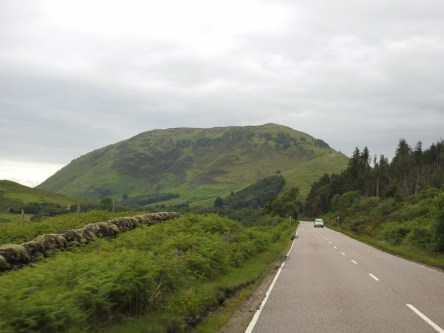](https://worldwideweatherblog.wordpress.com/wp-content/uploads/2018/02/dscn8565-desktop-resolution.jpg)

 _Efter det fortsätter vår resa vidare till Loch Ness och Fort Augustus._ _Också det för andra gången den här resan. Vägen dit är enormt vacker längs Skottlands smala slingrande vägar._

[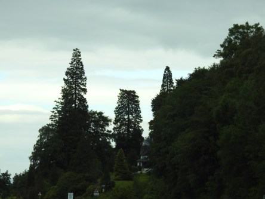](https://worldwideweatherblog.wordpress.com/wp-content/uploads/2018/02/dscn8581-desktop-resolution.jpg)

[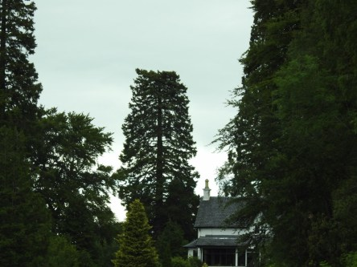](https://worldwideweatherblog.wordpress.com/wp-content/uploads/2018/02/dscn8584-desktop-resolution.jpg) _Här åker vi förbi ett träd som är alldeles platt på toppen. Anledningen till det är att ett flygplan har hamnat lite väl lågt vid ett tillfälle och kapat toppen på trädet. Det mest_ _otroliga var att strax efter att vår guide berättat om det här trädets öde så höll vi på att "krocka" med en jättestor_ _DC 3:a som kom flygande på väldigt låg höjd rakt emot oss. Den var så nära så vi satt och duckade i bussen. Det var en helt otrolig upplevelse som jag tyvärr inte fick någon bild på. Man sitter ju inte direkt beredd med kameran ifall det skulle dyka upp ett jättestort flygplan i takhöjd med med bilen direkt._

[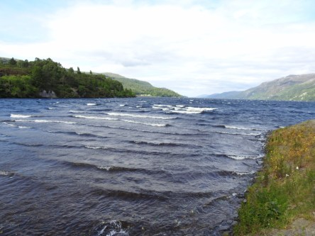](https://worldwideweatherblog.wordpress.com/wp-content/uploads/2018/02/dscn8592-desktop-resolution.jpg)

[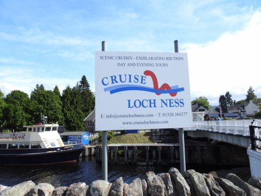](https://worldwideweatherblog.wordpress.com/wp-content/uploads/2018/02/dscn8596-desktop-resolution.jpg)

 _Här är vi framme vid Loch Ness igen och eftersom jag redan har lagt upp många bilder härifrån i tidigare inlägg så blir det bara dessa bilder den här gången._

 _Nästa stopp blir vid Urquhart Castle som ligger vid Loch ness._

[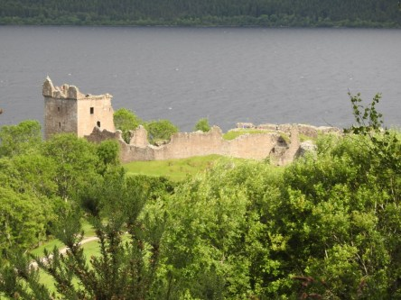](https://worldwideweatherblog.wordpress.com/wp-content/uploads/2018/02/dscn8603-desktop-resolution.jpg)

[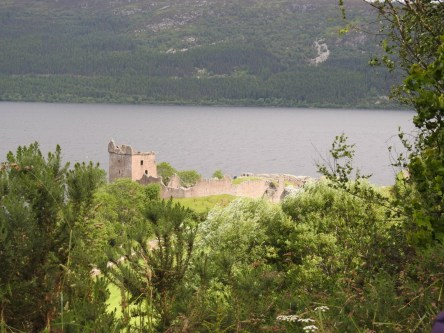](https://worldwideweatherblog.wordpress.com/wp-content/uploads/2018/02/dscn8600-desktop-resolution.jpg)

[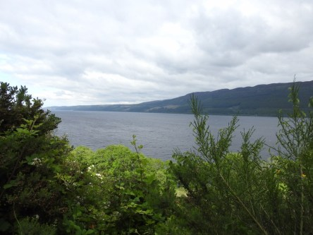](https://worldwideweatherblog.wordpress.com/wp-content/uploads/2018/02/dscn8604-desktop-resolution.jpg) _Utsikt mot slottet och Loch Ness._

[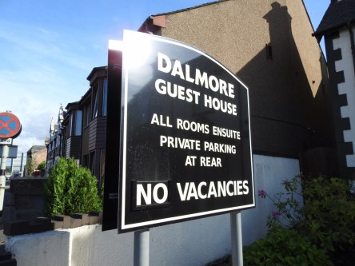](https://worldwideweatherblog.wordpress.com/wp-content/uploads/2018/02/dscn8632-desktop-resolution.jpg)

 _Nu är vi framme vid vårt hem för natten i Inverness. Det var väldigt speciellt för oss att bo här eftersom det var samma ställe som vi bodde på när vi var här på vår förra resa till Skottland. Så vi kände oss som hemma även om den lilla damen som äger det hade gjort ganska stora förändringar_ _och byggt ut och byggt om._

_I nästa inlägg blir det en rundtur i Inverness._
