**Äntligen på Orkneyöarna**

_Nu har vi äntligen kommit över till Orkneyöarna som jag alltid velat besöka. Här är väldigt blåsigt och kargt. Inte mycket träd eftersom de inte klarar att växa i den kraftiga blåsten. De flesta träd man ser är planterade och finns i trädgårdarna. Att få se dessa öar är en verklig upplevelse och det känns nästan som om man är i världens ände._

[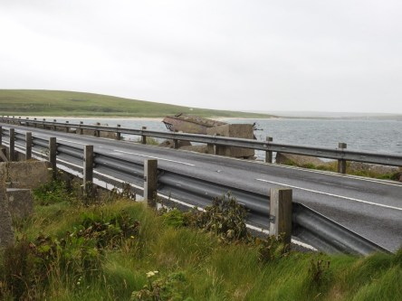](https://worldwideweatherblog.wordpress.com/wp-content/uploads/2018/04/dscn8879-desktop-resolution.jpg)

 _Som synes är det väldigt flackt och kargt på Orkney. Här är vi på väg till Mull Head naturreservat med den kollapsade grottan och de helt otroliga klipporna._

[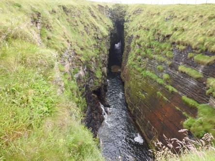](https://worldwideweatherblog.wordpress.com/wp-content/uploads/2018/04/dscn8891-desktop-resolution.jpg)

[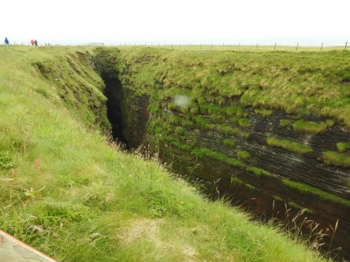](https://worldwideweatherblog.wordpress.com/wp-content/uploads/2018/04/dscn8892-desktop-resolution.jpg)

 _Här ser vi den [kollapsade grottan](https://www.visitscotland.com/info/see-do/gloup-mull-head-reserve-p669091). En gång i tiden så var detta en riktig grotta med tak._

[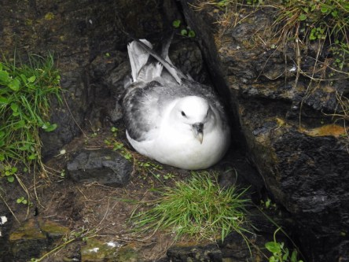](https://worldwideweatherblog.wordpress.com/wp-content/uploads/2018/04/dscn8898-desktop-resolution.jpg) _Det finns gott om fåglar som häckar här. Här en tretåig mås._

[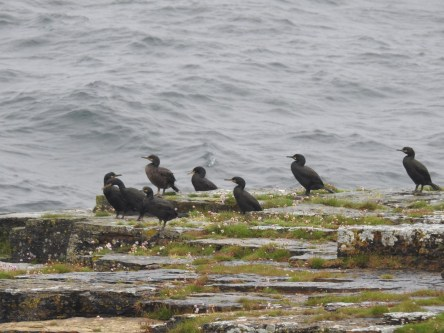](https://worldwideweatherblog.wordpress.com/wp-content/uploads/2018/04/dscn8901-desktop-resolution.jpg) _Ingen brist på skarvar precis. Det fanns mängder av dem._

[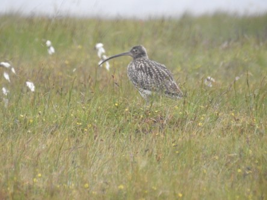](https://worldwideweatherblog.wordpress.com/wp-content/uploads/2018/04/dscn8929-desktop-resolution.jpg) _Även en och annan spov fick vi syn på._

[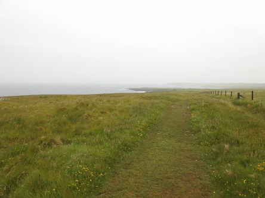](https://worldwideweatherblog.wordpress.com/wp-content/uploads/2018/04/dscn8906-desktop-resolution.jpg) _Vy på väg ner till klipporna. Det regnade och blåste så att vi knappt kunde gå upprätt bitvis. Och att föra ett normalt samtal var inte att tänka på i oljudet från vinden_

[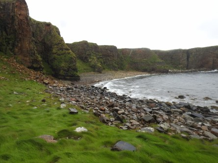](https://worldwideweatherblog.wordpress.com/wp-content/uploads/2018/04/dscn8912-desktop-resolution.jpg)

[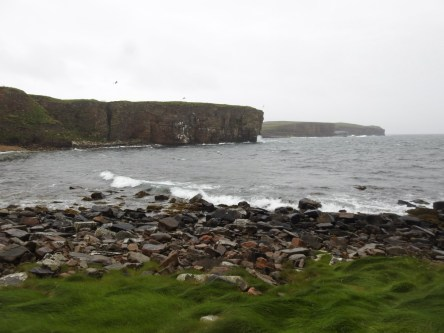](https://worldwideweatherblog.wordpress.com/wp-content/uploads/2018/04/dscn8913-desktop-resolution.jpg) _Väl nere vid havet bland klipporna blev det lite lugnare._

 _Här är det helt fantastiskt. Det är så vackert. Men klipporna är hala och förrädiska, så det gäller att se upp med var man sätter fötterna._

[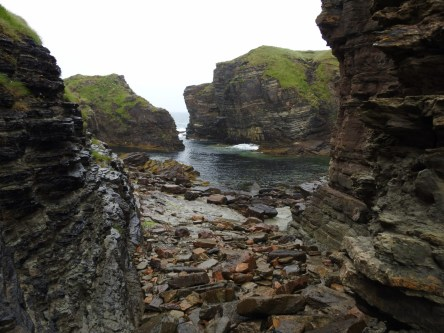](https://worldwideweatherblog.wordpress.com/wp-content/uploads/2018/04/dscn8120-desktop-resolution.jpg)

[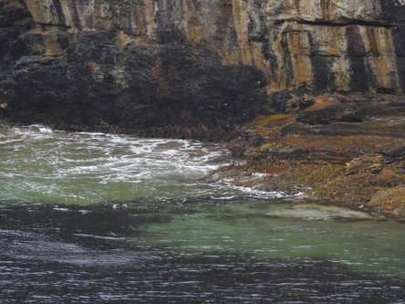](https://worldwideweatherblog.wordpress.com/wp-content/uploads/2018/04/dscn8130-desktop-resolution.jpg)

[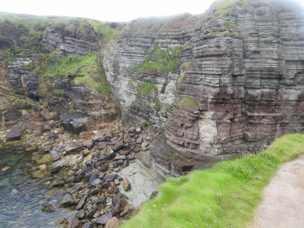](https://worldwideweatherblog.wordpress.com/wp-content/uploads/2018/04/dscn8132-desktop-resolution.jpg)

[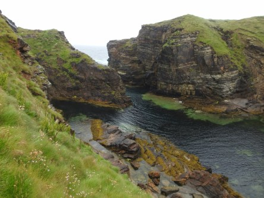](https://worldwideweatherblog.wordpress.com/wp-content/uploads/2018/04/dscn8135-desktop-resolution.jpg)

[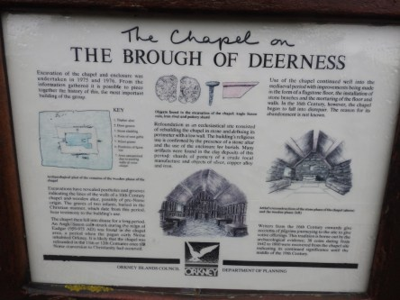](https://worldwideweatherblog.wordpress.com/wp-content/uploads/2018/04/dscn8137-desktop-resolution.jpg)

[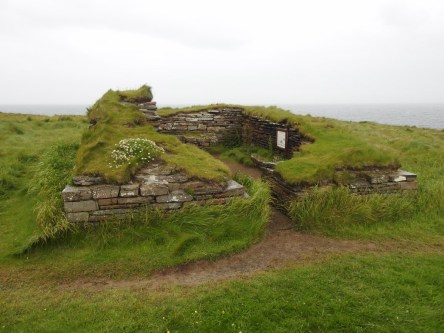](https://worldwideweatherblog.wordpress.com/wp-content/uploads/2018/04/dscn8138-desktop-resolution.jpg)

[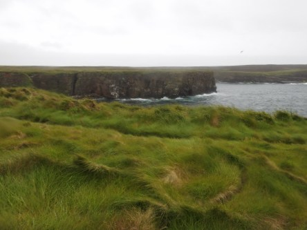](https://worldwideweatherblog.wordpress.com/wp-content/uploads/2018/04/dscn8140-desktop-resolution.jpg)

[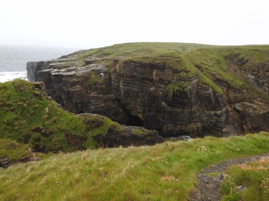](https://worldwideweatherblog.wordpress.com/wp-content/uploads/2018/04/dscn8152-desktop-resolution.jpg)

 _Helt enkelt en otrolig naturupplevelse värd allt besvär._
