**Maeshowe och Ring of Brodgar**

_Idag går färden vidare till Maeshowe som är en gravkammare från yngre stenåldern. Den här valde jag att bara se från utsidan eftersom det är en väldigt smal,låg och ungefär 20 meter lång tunnel att gå igenom för att komma in dit. Min cellskräck satte definitivt stopp för det äventyret. Du kan läsa mer om den här graven [här](https://sv.wikipedia.org/wiki/Maeshowe)._

[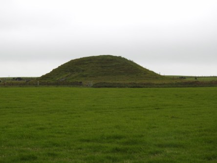](https://worldwideweatherblog.wordpress.com/wp-content/uploads/2018/05/dscn8935-desktop-resolution.jpg) _På väg mot graven._

[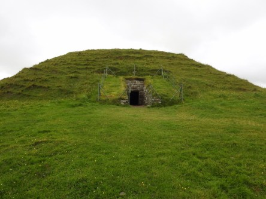](https://worldwideweatherblog.wordpress.com/wp-content/uploads/2018/05/dscn8940-desktop-resolution.jpg) _Här är ingången till graven. Det här hålet räckte ungefär upp till midjan på oss._

[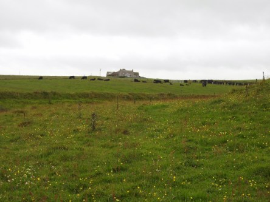](https://worldwideweatherblog.wordpress.com/wp-content/uploads/2018/05/dscn8942-desktop-resolution.jpg)

[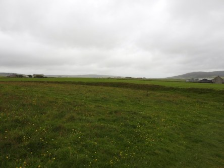](https://worldwideweatherblog.wordpress.com/wp-content/uploads/2018/05/dscn8944-desktop-resolution.jpg)

[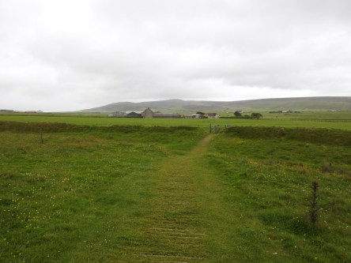](https://worldwideweatherblog.wordpress.com/wp-content/uploads/2018/05/dscn8946-desktop-resolution.jpg)

[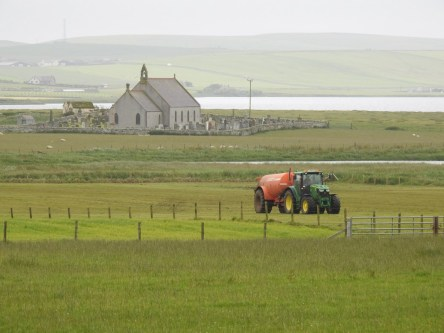](https://worldwideweatherblog.wordpress.com/wp-content/uploads/2018/05/dscn8957-desktop-resolution.jpg)

 _Lite från omgivningen runtomkring graven._

[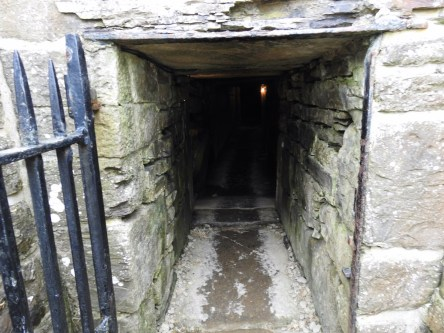](https://worldwideweatherblog.wordpress.com/wp-content/uploads/2018/05/dscn8963-desktop-resolution.jpg) _Här är ingången till graven. En lång smal och låg gång._

[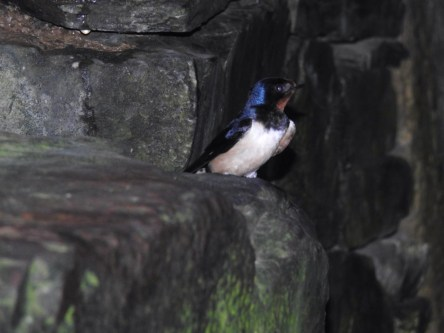](https://worldwideweatherblog.wordpress.com/wp-content/uploads/2018/05/dscn8968-desktop-resolution.jpg)

[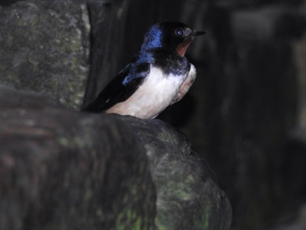](https://worldwideweatherblog.wordpress.com/wp-content/uploads/2018/05/dscn8970-desktop-resolution.jpg) _Den här lilla svalan hade ett bo inne i graven och flög omkring därinne och vid öppningen._

 _Nu beger vi oss till Ring of Brodgar, en av alla stensamlingar på Orkney. Det finns hur många som helst. Vissa av dem har de ingen aning om varför de uppfördes. Den här är betydligt äldre än Stonehenge._

[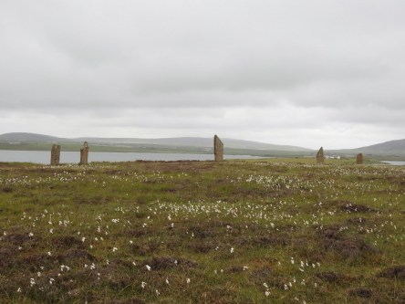](https://worldwideweatherblog.wordpress.com/wp-content/uploads/2018/05/dscn8992-desktop-resolution.jpg)

[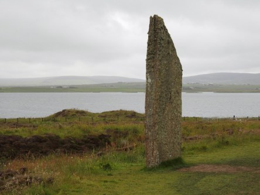](https://worldwideweatherblog.wordpress.com/wp-content/uploads/2018/05/dscn8993-desktop-resolution.jpg)

[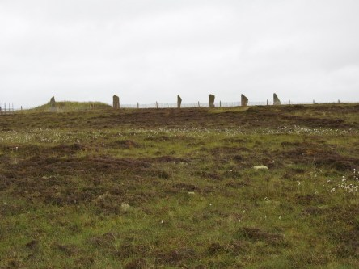](https://worldwideweatherblog.wordpress.com/wp-content/uploads/2018/05/dscn8995-desktop-resolution.jpg)

[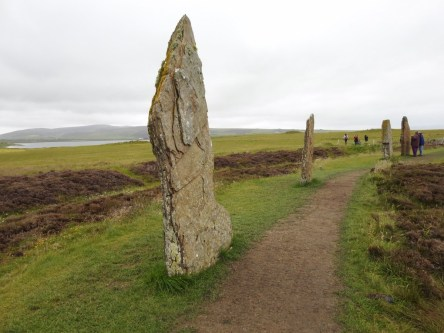](https://worldwideweatherblog.wordpress.com/wp-content/uploads/2018/05/dscn8999-desktop-resolution.jpg)

[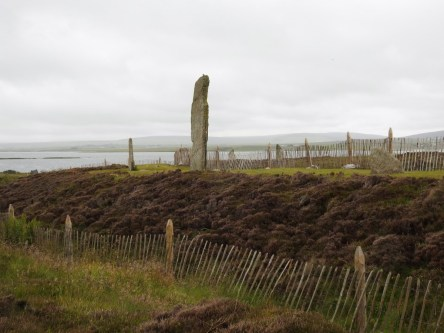](https://worldwideweatherblog.wordpress.com/wp-content/uploads/2018/05/dscn9024-desktop-resolution.jpg) _Alla dessa stenar står uppradade i en prydlig ring som är väldigt_ _stor och inte får plats i ett foto om man inte är väldigt långt ifrån eller tar en panoramabild. Vill du läsa mer om Ring of Brodgar kan du göra det [här](https://sv.wikipedia.org/wiki/Ring_of_Brodgar)._

_I nästa inlägg fortsätter vår resa runt Orkney._
