**House of Skaill**

_Nu går vi vidare till Skaill House, ett väl bevarad herrgård från 1700-talet. Du kan läsa mer om det [här](https://en.wikipedia.org/wiki/Skaill_House).  De flesta av dessa bilder har jag redan lagt upp i tidigare inlägg, men för dem som inte sett dem så tar jag med dem igen i den här kronologiska serien av vår resa genom Skottland._

[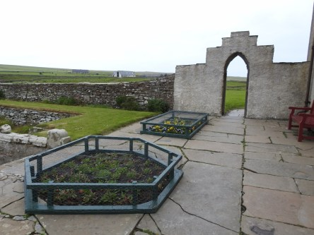](https://worldwideweatherblog.wordpress.com/wp-content/uploads/2018/06/dscn9181-desktop-resolution.jpg)

 _Skaill House och trädgården runt omkring, med kanoner utplacerade lite överallt. Det kan ju vara användbart vid objudna_ _besök hahaha._

[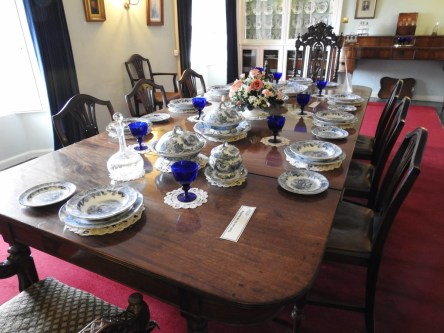](https://worldwideweatherblog.wordpress.com/wp-content/uploads/2018/06/dscn9184-desktop-resolution.jpg)

[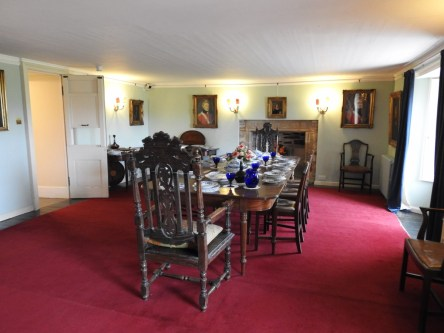](https://worldwideweatherblog.wordpress.com/wp-content/uploads/2018/06/dscn9186-desktop-resolution.jpg) _Matsal med vackert dukat bord._

[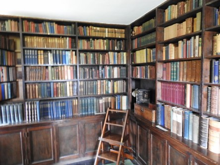](https://worldwideweatherblog.wordpress.com/wp-content/uploads/2018/06/dscn9188-desktop-resolution.jpg) _Välfyllt bibliotek för den som älskar att läsa._

[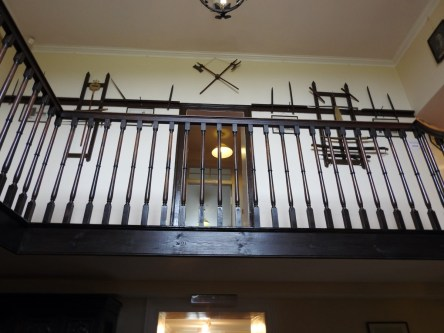](https://worldwideweatherblog.wordpress.com/wp-content/uploads/2018/06/dscn9194-desktop-resolution.jpg) _Övervåningen._

[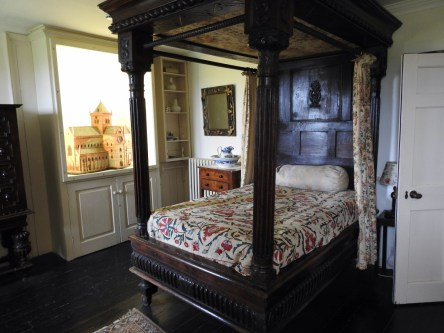](https://worldwideweatherblog.wordpress.com/wp-content/uploads/2018/06/dscn9196-desktop-resolution.jpg)

[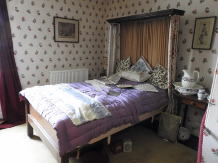](https://worldwideweatherblog.wordpress.com/wp-content/uploads/2018/06/dscn9204-desktop-resolution.jpg) _Sovrum på övervåningen. Sängarna var väldigt korta, så de som en gång sovit här måste varit småväxta. Jag är inte jättelång,163 cm, men mer än än mina fötter hade hamnat utanför här._

[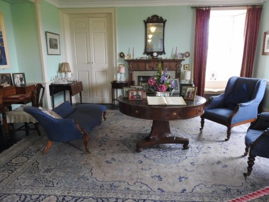](https://worldwideweatherblog.wordpress.com/wp-content/uploads/2018/06/dscn9197-desktop-resolution.jpg) _Ett vardagsrum med öppen spis._

[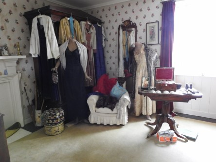](https://worldwideweatherblog.wordpress.com/wp-content/uploads/2018/06/dscn9207-desktop-resolution.jpg) _Ännu ett sovrum med välfylld garderob._

 _Öppenspis._

[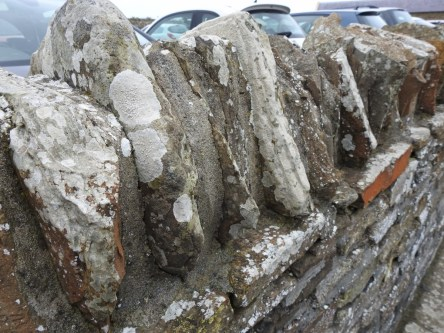](https://worldwideweatherblog.wordpress.com/wp-content/uploads/2018/06/dscn9216-desktop-resolution.jpg) _Nu är vi utanför igen och den här lite annorlunda stenmuren tyckte jag var intressant._

[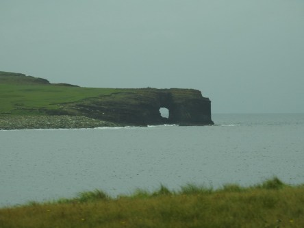](https://worldwideweatherblog.wordpress.com/wp-content/uploads/2018/06/dscn9219-desktop-resolution.jpg) _På väg mot nästa mål med utsikt mot havet._

[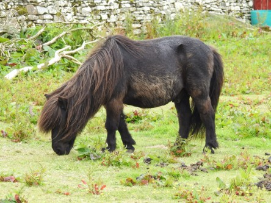](https://worldwideweatherblog.wordpress.com/wp-content/uploads/2018/06/dscn9251-desktop-resolution.jpg) _Små hästar finns det gott om på Orkney._

[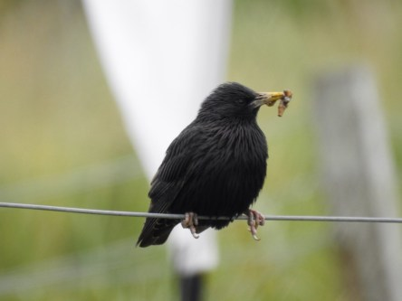](https://worldwideweatherblog.wordpress.com/wp-content/uploads/2018/06/dscn9256-desktop-resolution.jpg)

[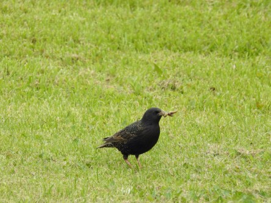](https://worldwideweatherblog.wordpress.com/wp-content/uploads/2018/06/dscn9264-desktop-resolution.jpg)

 _Och hungriga starar i massor också._

_I nästa inlägg blir det besök vid Kirbuster Museum och vid The Broch._
