**Kirbuster museum och The Broch.**

_Nu går färden vidare till [Kirbuster](http://www.spirit-of-orkney.com/contents1a/2010/04/kirbuster-farm-museum/) museum och The [Broch.](https://en.wikipedia.org/wiki/Broch_of_Gurness) Eftersom jag har gjort inlägg om detta tidigare så blir det bara kortfattat den här gången. I länkarna ovan kan ni läsa mer om dessa ställen. Flera av dessa bilder finns med i tidigare inlägg men tål att ses igen._

 _Johannes vid ingången till det här lilla huset som är det bäst bevarade i sitt slag. Det är dessutom i originalskick och har inte [restaurerats](http://www.orkney.gov.uk/Service-Directory/S/kirbuster-museum.htm)_

 _[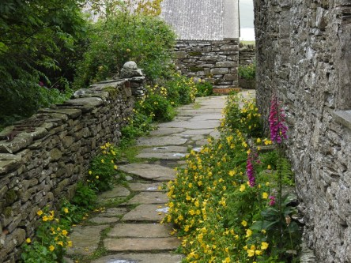](https://worldwideweatherblog.wordpress.com/wp-content/uploads/2018/07/dscn9277-desktop-resolution.jpg) Ingången till huset och trädgården._

[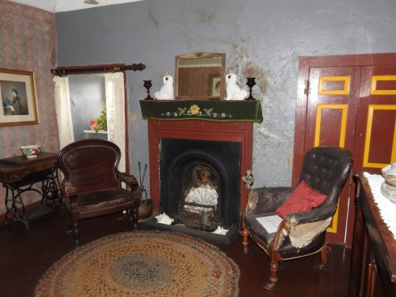](https://worldwideweatherblog.wordpress.com/wp-content/uploads/2018/07/dscn9296-desktop-resolution.jpg)

 _Olika rum i huset._

[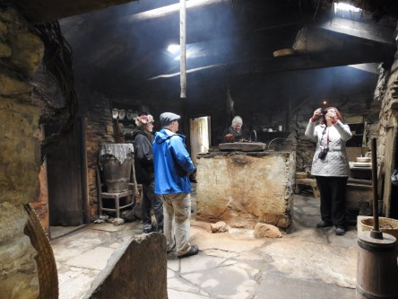](https://worldwideweatherblog.wordpress.com/wp-content/uploads/2018/07/dscn9302-desktop-resolution.jpg) _Den klassiska eldstaden. Här luktade det riktigt illa av rök._

[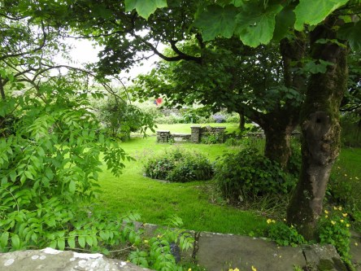](https://worldwideweatherblog.wordpress.com/wp-content/uploads/2018/07/dscn9305-desktop-resolution.jpg)

[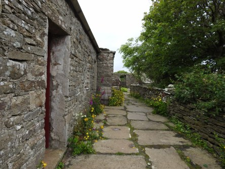](https://worldwideweatherblog.wordpress.com/wp-content/uploads/2018/07/dscn9308-desktop-resolution.jpg)

[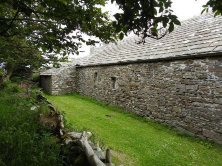](https://worldwideweatherblog.wordpress.com/wp-content/uploads/2018/07/dscn9319-desktop-resolution.jpg)

[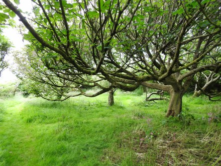](https://worldwideweatherblog.wordpress.com/wp-content/uploads/2018/07/dscn9324-desktop-resolution.jpg) _Den härliga lilla trädgården._

 _Ett redskapsskjul._

 _Utanför gick två små shetlandsponnyer och betade. Den här visade inget större intresse för oss._

 _Men den här var desto nyfiknare._

 _Nu går färden vidare till The Broch._

[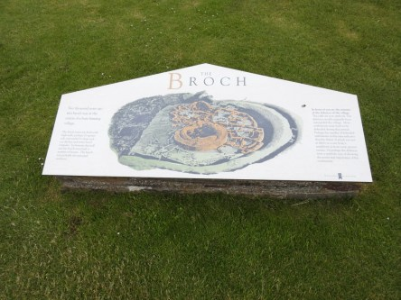](https://worldwideweatherblog.wordpress.com/wp-content/uploads/2018/07/dscn9345-desktop-resolution.jpg) _Informationsskylt._

[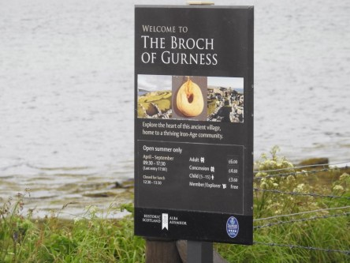](https://worldwideweatherblog.wordpress.com/wp-content/uploads/2018/07/dscn9404-desktop-resolution.jpg) _Ännu en informationsskylt._

[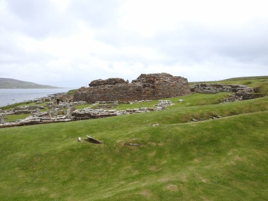](https://worldwideweatherblog.wordpress.com/wp-content/uploads/2018/07/dscn9347-desktop-resolution.jpg)

[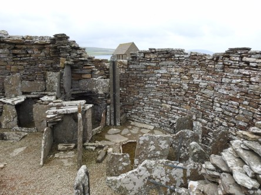](https://worldwideweatherblog.wordpress.com/wp-content/uploads/2018/07/dscn9375-desktop-resolution.jpg)

 _Bilder från det lilla samhället. I länken ovan kan du läsa mer om dess historia._

 _Med den här kråkan som undrar vad jag vill så avslutar jag det här inlägget. I nästa inlägg går färden vidare på Orkney med hisnade utsikter och vacker natur. Vi börjar närma oss slutet på vår 11 dagar långa resa runt Skottland, men ännu är det lite kvar att se._
