**Brough of Birsay och Kirkwall**

_Efter ett litet uppehåll tänkte jag nu ta tag i min serie från vår resa runt Skottland förra sommaren. Det här inlägget visar vår sista dag på Orkney. Vi besökte Birsay och senare på kvällen gick vi en runda i Kirkwall, Orkneys huvudstad._

[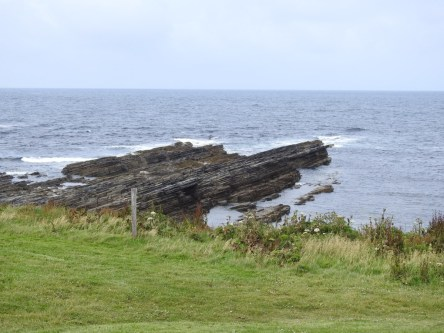](https://worldwideweatherblog.wordpress.com/wp-content/uploads/2018/08/dscn9414-desktop-resolution.jpg)

[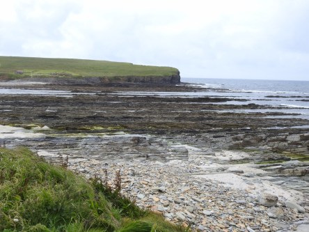](https://worldwideweatherblog.wordpress.com/wp-content/uploads/2018/08/dscn9418-desktop-resolution.jpg)

[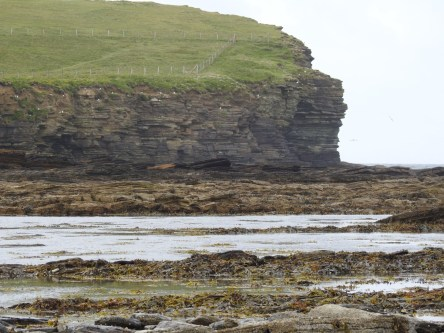](https://worldwideweatherblog.wordpress.com/wp-content/uploads/2018/08/dscn9426-desktop-resolution.jpg)

[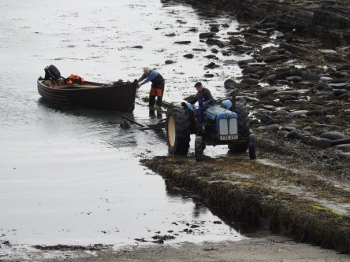](https://worldwideweatherblog.wordpress.com/wp-content/uploads/2018/08/dscn9441-desktop-resolution.jpg) _Här är vi nere och går vid Brough of Birsay. Som allt annat i Skottland så är det väldigt vackert och när vi var där var det lågvatten och man kunde gå över till fyren på andra sidan om man ville. Tyvärr så var det en väldigt lång vandring och vi hann aldrig med den. Men vi såg fyren och kunde ta bilder på den från den sida vi var på._ [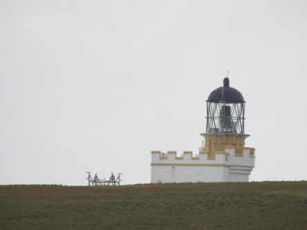](https://worldwideweatherblog.wordpress.com/wp-content/uploads/2018/08/dscn9431-desktop-resolution.jpg) _Här är en bild på toppen av fyren._ [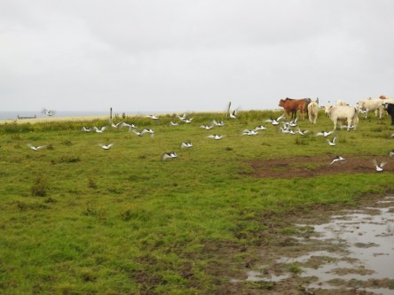](https://worldwideweatherblog.wordpress.com/wp-content/uploads/2018/08/dscn9448-desktop-resolution.jpg)

 _En stor flock strandskator ville inte vara med på bild. Precis när vi stannade bussen för att ta bilder på dem så skrämde ett gäng kor iväg dem. Vi såg dessa fåglar överallt på Orkney men fick aldrig något bra tillfälle att ta bilder på dem så när vi såg det här gänget blev vi överlyckliga och var redo att fota i massor. Men säg den lycka som varar, hahaha._

[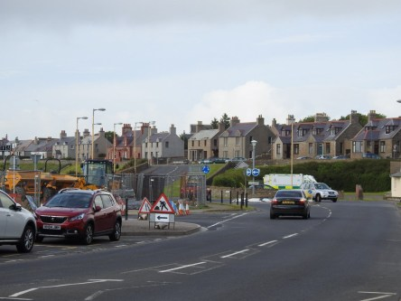](https://worldwideweatherblog.wordpress.com/wp-content/uploads/2018/08/dscn9463-desktop-resolution.jpg) _Här börjar vår promenad från centrum i Kirkwall till vårt B&B för vår sista natt på Orkney._

[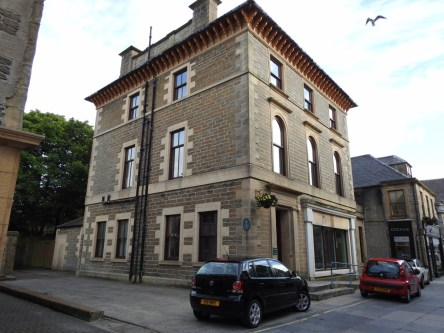](https://worldwideweatherblog.wordpress.com/wp-content/uploads/2018/08/dscn9466-desktop-resolution.jpg)

[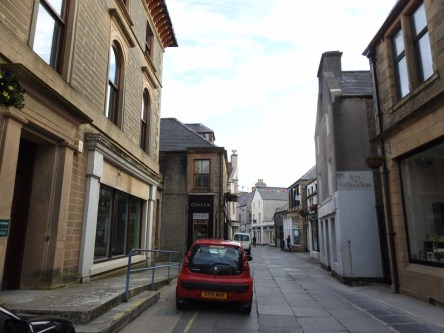](https://worldwideweatherblog.wordpress.com/wp-content/uploads/2018/08/dscn9468-desktop-resolution.jpg)

[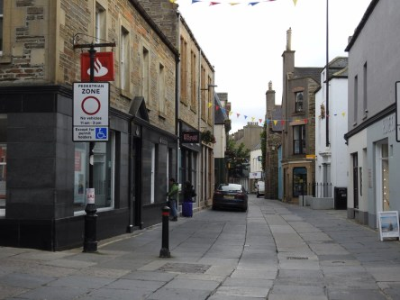](https://worldwideweatherblog.wordpress.com/wp-content/uploads/2018/08/dscn9470-desktop-resolution.jpg)

[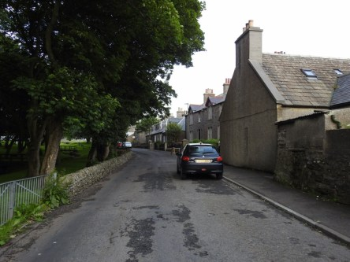](https://worldwideweatherblog.wordpress.com/wp-content/uploads/2018/08/dscn9493-desktop-resolution.jpg)

[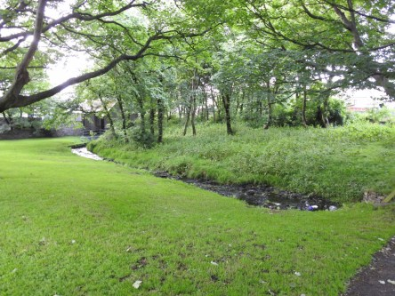](https://worldwideweatherblog.wordpress.com/wp-content/uploads/2018/08/dscn9498-desktop-resolution.jpg)

[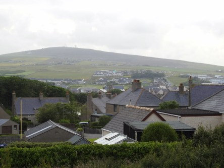](https://worldwideweatherblog.wordpress.com/wp-content/uploads/2018/08/dscn9510-desktop-resolution.jpg)

[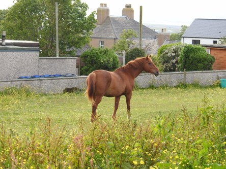](https://worldwideweatherblog.wordpress.com/wp-content/uploads/2018/08/dscn9523-desktop-resolution.jpg)

[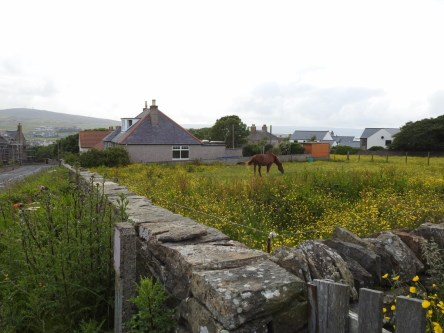](https://worldwideweatherblog.wordpress.com/wp-content/uploads/2018/08/dscn9526-desktop-resolution.jpg)

 _Första kvällen i Kirkwall fick vi uppleva äkta Orkneyväder med halv storm och ösregn. Vi var fullständigt genomblöta in på bara kroppen. Men andra kvällen var det underbart väder så vi kunde äntligen gå en lång runda och uppleva lite av staden. Det här är lite bilder tagna på vägen till vårt boende._

 _Det här är vårt väldigt trevliga B&B i Kirkwall._

_I nästa inlägg är vi åter tillbaka på fastlandet för den avslutande delen på vår busstur innan vi tillbringar ett par dagar i Edinburgh för att sedan åka hem till Sverige igen._
