**På väg till fastlandet**

_Vi tar en sista promenad i Kirkwall och sen går färden tillbaka till fastlandet igen. Det blir många bilder här för det är så mycket vackra vyer vi passerar på vägen till Edinburgh._

[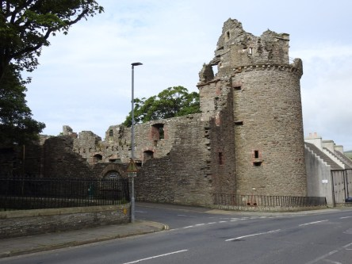](https://worldwideweatherblog.wordpress.com/wp-content/uploads/2018/09/dscn9559-desktop-resolution.jpg)

[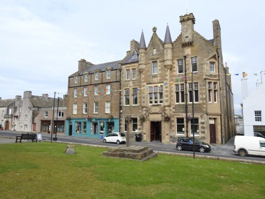](https://worldwideweatherblog.wordpress.com/wp-content/uploads/2018/09/dscn9567-desktop-resolution.jpg) _En kort rundvandring i Kirkwall avslutar vårt besök på Orkney._

[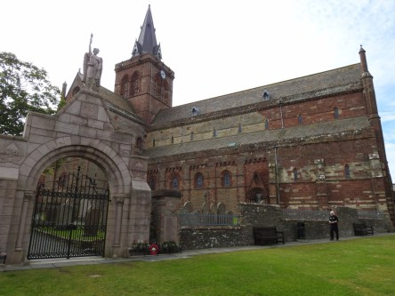](https://worldwideweatherblog.wordpress.com/wp-content/uploads/2018/09/dscn9570-desktop-resolution.jpg) _Sankt Magnus Katedralen i Kirkwall. Läs mer om den [här](https://sv.wikipedia.org/wiki/Sankt_Magnuskatedralen)_

 _En marknad med allt möjligt och omöjligt att köpa._

[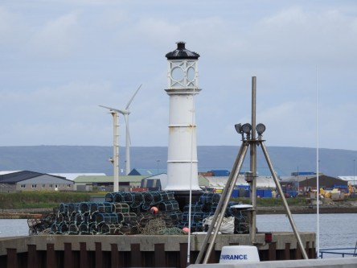](https://worldwideweatherblog.wordpress.com/wp-content/uploads/2018/09/dscn9581-desktop-resolution.jpg) _Dags för avfärd och hemfärd till fastlandet._

 _Här passerar vi de sänkta skeppen i [Scapa Flow](https://sv.wikipedia.org/wiki/Scapa_Flow)_

 _ Sista vyn från Orkney._

[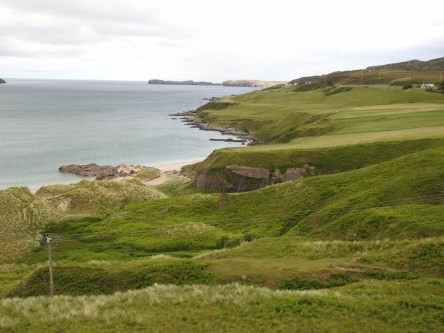](https://worldwideweatherblog.wordpress.com/wp-content/uploads/2018/09/dscn9624-desktop-resolution.jpg)

[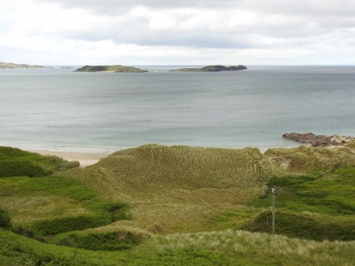](https://worldwideweatherblog.wordpress.com/wp-content/uploads/2018/09/dscn9625-desktop-resolution.jpg)

[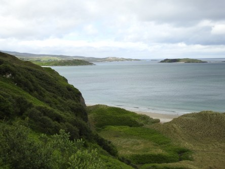](https://worldwideweatherblog.wordpress.com/wp-content/uploads/2018/09/dscn9626-desktop-resolution.jpg)

[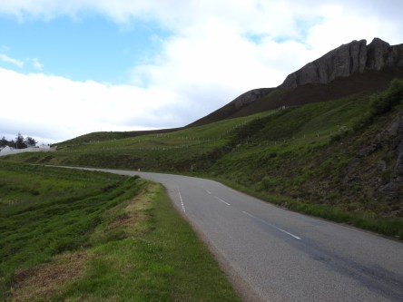](https://worldwideweatherblog.wordpress.com/wp-content/uploads/2018/09/dscn9632-desktop-resolution.jpg)

 _Helst fantastiska vyer utmed Dunrobin Glen på vägen ner till Inverness_

[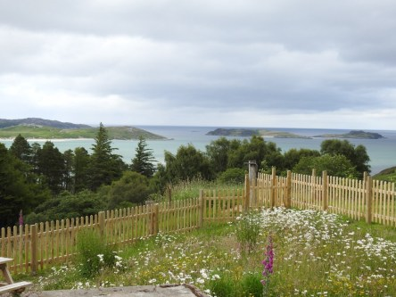](https://worldwideweatherblog.wordpress.com/wp-content/uploads/2018/09/dscn9644-desktop-resolution.jpg)

[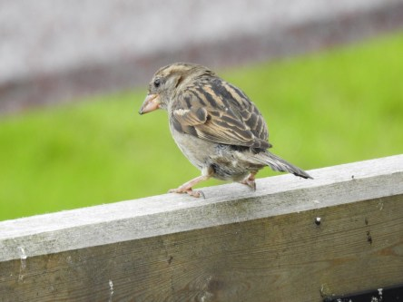](https://worldwideweatherblog.wordpress.com/wp-content/uploads/2018/09/dscn9651-desktop-resolution.jpg)

[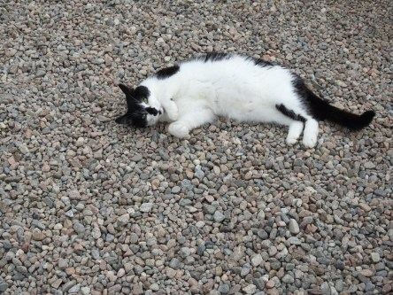](https://worldwideweatherblog.wordpress.com/wp-content/uploads/2018/09/dscn9671-desktop-resolution.jpg)

 _Vi stannar till för en liten paus och bensträckare._

[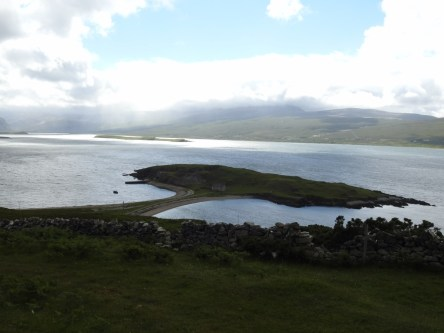](https://worldwideweatherblog.wordpress.com/wp-content/uploads/2018/09/dscn9714-desktop-resolution.jpg)

 _En liten udde som jag inte kommer ihåg namnet på tyvärr._

[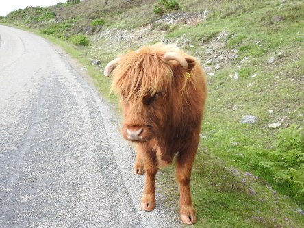](https://worldwideweatherblog.wordpress.com/wp-content/uploads/2018/09/dscn9751-desktop-resolution.jpg)

[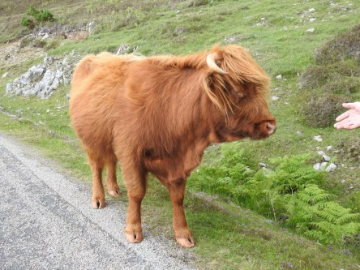](https://worldwideweatherblog.wordpress.com/wp-content/uploads/2018/09/dscn9758-desktop-resolution.jpg) _Och naturligtvis måste man stanna för att se och klappa dessa kossor som går omkring överallt på höglandet._

[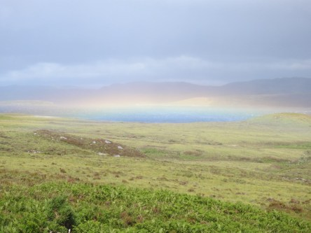](https://worldwideweatherblog.wordpress.com/wp-content/uploads/2018/09/dscn9775-desktop-resolution.jpg) _En vacker markregnbåge vi såg på vägen får avsluta det här inlägget._

_I nästa inlägg besöker vi en grotta på vår väg mot Edinburgh._
