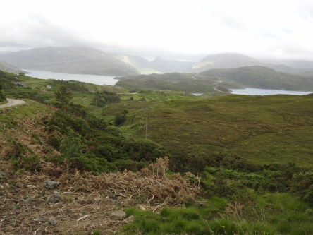
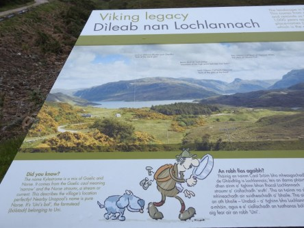
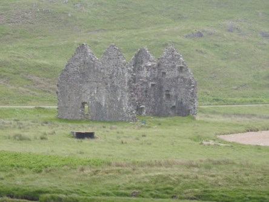
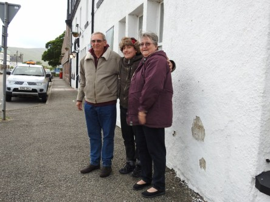

**Smoo cave, slott och Ullapool**

_Nu är det inte så mycket kvar på vår resa. På vår väg tillbaka stannar vi till på olika platser för att njuta av den underbara utsikten som finns överallt på höglandet. Vi ser slott och vi besöker en grotta med ett vackert vattenfall. Sen tar vi en snabb runda i Ullapool där vi ska övernatta innan färden går vidare till Edinburgh._

 _På väg ner till Smoo Cave, en grotta med ett fantastiskt vattenfall._

 _Utanför grottan._

 _Inne i grottan._

 _Sista delen av vattenfallet som är mycket högre än som syns här._

 _Det ser ut som ett månlandskap i grottan._

 _I de här hålen bor alla möjliga fåglar._

 _Fantastiskt utsikt på vår väg mot Ullapool_

 _Ardvreck Castle och Calda House. Två slottsruiner._

 _Det blev en kort runda i Ullapool där vi övernattade den sista natten innan vi åkte tillbaka till Edinburgh. Det var iskallt och blåste småspik så därför blev rundan inte så lång._

 _Johannes med två av sina nyvunna bästisar. Ett helt underbart_ _och härligt par från Australien. Oj vad vi saknade alla våra_ _reskompisar när resan var slut._
