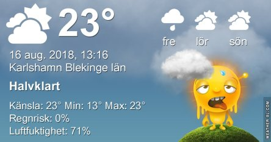
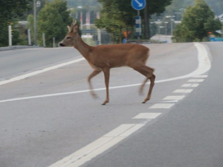

Idag går solen upp 05:32 och ned 20:36. Dagens längd är 15 timmar och 04 minuter. Det är gryning 04:49 och skymning 21:19 Det är dagsljus 16 timmar och 30 minuter. Månen går upp 12:06 och ned 22:43 Månen är belyst 28 %.

 Mest klart 10,8 C  Vindstilla  Luftfuktighet 96 %  hPa 1013 Kl.02:15

 Tunna moln 11,4 C  Vindstilla  Luftfuktighet 99 %  hPa 1014 Kl.06:40

 Halvklart 29,8 C  Vindby 3,4 m/s WSW  Luftfuktighet 61 %  hPa 1013 Kl.13:30

 Halvklart 17,2 C  Vindby 0,7 m/s SW  Luftfuktighet 91 %  hPa 1012 Kl.21:35

 Pust och stön, värmen ger aldrig med sig verkar det som!

Högst och lägst uppmätta temperatur igår (inofficiellt privat mätare): Max 31,1 ( i solen ) C, Min 12,3 C Högst uppmätta vind 3,1 m/s. Högst uppmätta vindby 6,1 m/s

Högst och lägst uppmätta temperatur igår (officiellt enligt [YR.NO](http://www.vackertvader.se/v%C3%A4derstation/karlshamn?utm_source=email&utm_medium=email&utm_campaign=asarum)) Max 25,3 C, Min 11,9 C Högst uppmätta vind 3,6 m/s. Högst uppmätta vindby 8,5 m/s

 Helt plötsligt stod rådjuret mitt på vägen framför min bil. Snabbt fick jag upp kameran, men den hann börja springa iväg. Men det blev rätt skapliga bilder med rörelseoskärpa ändå.

 Och den evinnerliga soluppgången igen.
