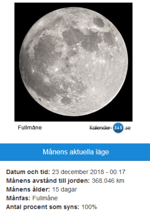

Idag går solen upp 08:32 och ned 15:27 Dagens längd är 6 timmar och 55 minuter. Det är gryning 07:45 och skymning 16:15 Det är dagsljus 8 timmar och 30 minut. Månen går upp 16:36 och ned 08:50 Månen är belyst 100 %.

  Klart - 6,9 C  Vindstilla  Luftfuktighet 83 %  hPa 1010 Kl.01:00

 Mest molnigt - 3,1 C  Vindstilla  Luftfuktighet 83 %  hPa 1010 Kl.07:00

 Molnigt - 0,8 C  Vindby 2 m/s N  Luftfuktighet 75 %  hPa 1009 Kl.13:30

 Växlande molnighet - 2,8 C  Vindby 0,3 m/s S  Luftfuktighet 78 %  hPa 1010 Kl.19:20

Högst och lägst uppmätta temperatur igår (inofficiellt privat mätare) Max 1,5 C , Min - 6,7 C Högst uppmätta vind 4,4 m/s, Högst uppmätta vindby 6,1 m/s

Högst och lägst uppmätta temperatur igår (officiellt enligt [YR.NO](http://www.vackertvader.se/v%C3%A4derstation/karlshamn?utm_source=email&utm_medium=email&utm_campaign=asarum)) Max ? C, Min ? C Högst uppmätta vind ? m/s. Högst uppmätta vindby ? m/s

 Än är det vinter och mörkt ,men...

 ... nu är dagen redan en minut längre! Så nu går det fort till sommaren igen... kan man ju alltid intala sig!
