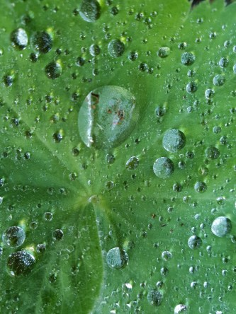
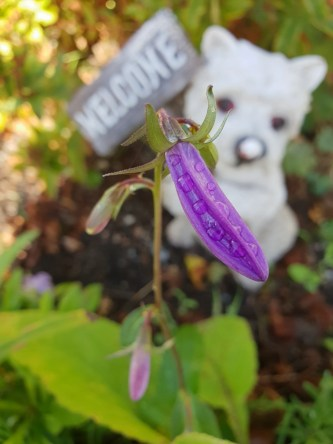

Idag går solen upp 07:03 och ned 18:36. Dagens längd är 11 timmar och 33 minuter. Det är gryning 06:26 och skymning 19:13 Det är dagsljus 12 timmar och 47 minuter. Månen går upp 22:17 och ned 14:13 Månen är belyst 65 %.

 Mest molnigt 8,2 C  Vindstilla  Luftfuktighet 94 %  hPa 1006 Kl.01:05

 Växlande molnighet 3,9 C  Vindstilla  Luftfuktighet 98 %  hPa 1005 Kl.07:05

 Växlande molnighet 16,8 C  Vindby 1,6 m/s SSE  Luftfuktighet 47 %  hPa 1005  Regn 1,2 mm Kl.13:50

 Växlande molnighet 3,8 C  Vindstilla  Luftfuktighet 91 %  hPa 1006 Kl.19:50

 Det kom en liten skvätt regn idag, men som vanligt blev det med betoning på lite!

Högst och lägst uppmätta temperatur igår (inofficiellt privat mätare): Max 18,3 C , Min 8,4 C Högst uppmätta vind 3,7 m/s, Högst uppmätta vindby 6,1 m/s

Högst och lägst uppmätta temperatur igår (officiellt enligt [YR.NO](http://www.vackertvader.se/v%C3%A4derstation/karlshamn?utm_source=email&utm_medium=email&utm_campaign=asarum)) Max 16 C, Min 8,7 C Högst uppmätta vind 2,9 m/s. Högst uppmätta vindby 7,2 m/s

 Från morgon till kväll. Blandade bilder från trädgården idag.
